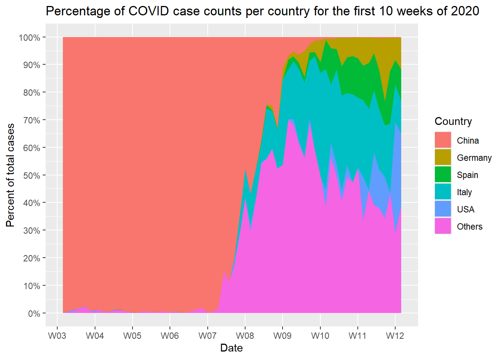

## Lưu ý

::: callout-note
#### Bài làm

Được lưu theo thư mục `R-Together/day2/takehome.R`
:::

::: callout-note
#### Piping

Dự kiến các câu lệnh sẽ chủ yếu sử dụng toán tử `%>%`, thay vì đặt các lệnh bên trong nhau.
:::

## Dữ liệu

Tương tự như bài tập Day 1, chúng ta cũng sẽ sử dụng `covid_cases.rds` trong `R-Together/day1/data/covid_cases.rds` cho bài tập này.

## Bài tập

### Nhiệm vụ 1: Nhập dữ liệu

-   Đọc dữ liệu từ `R-Together/day1/data/covid_cases.rds`.

-   Gọi thư viện `tidyverse`

::: callout-note
#### Lưu ý

`tidyverse` là một meta-package (chứa nhiều packages khác).
:::

### Nhiệm vụ 2: Làm sạch và lọc dữ liệu

-   Dữ liệu có tuân theo quy tắc **tidy data** không?
    -   Nếu không, xoay dữ liệu thành một tibble tuân theo tiêu chuẩn **tidy data**.
    
-   Hãy sử dụng `skimr` để kiểm tra toàn diện dữ liệu. Kiểm tra xem có biến nào không hợp lý không? 
    -   Nếu có thì gán toàn bộ dữ liệu sai vào `incorrect_data`.
    -   Loại bỏ những dòng bị sai và gán vào `correct_data`.
    
-   Lọc dữ liệu để chúng ta chỉ có **tuần 3-12** của năm 2020 và gán thành `covid_cases`.

::: callout-tip
#### Chuyển đổi kiểu bảng 
-   Nếu dữ liệu của bạn không phải là **tidy data**:
    -   “Kéo dài” dữ liệu bằng `pivot_longer()`, tức là ít cột hơn, nhiều hàng hơn.
    -   “Mở rộng” dữ liệu bằng `pivot_wider()`, tức là ít hàng hơn, nhiều cột hơn.
:::

::: callout-tip
#### Xử lý và làm sạch dữ liệu
-   Biến chính ở đây là số ca bệnh từ mỗi quốc gia. Chúng phải có kiểu số và không được thấp hơn 0. Bạn không thể có số ca bệnh âm.

-   Bạn có thể xóa hoặc lọc các giá trị không mong muốn bằng cách sử dụng `filter()`.

-   `lubridate` là package tốt nhất để xử lý dữ liệu ngày tháng
:::

### Nhiệm vụ 3: Chuyển đổi dữ liệu

-   Sử dụng `covid_cases` được tạo từ Nhiệm vụ 2 để thực hiện:
    -   Nhóm dữ liệu và tính tổng số ca bệnh theo mỗi quốc gia.
    -   Chọn 5 quốc gia có tổng số ca bệnh cao nhất.
    -   Trích xuất mã quốc gia và lưu chúng vào một đối tượng mới là `top_countries`.
    
-   Sử dụng lần nữa `covid_cases` từ Nhiệm vụ 2 để thực hiện:
    -   Nhóm lại dữ liệu, tính lại tổng số ca bệnh theo từng quốc gia.
    -   Hiệu chỉnh cột `country` theo các yêu cầu:
        -   Chỉ giữ lại tên của các quốc gia trong top 5 (đã tạo ở trên). **Các quốc gia khác** sẽ được đổi thành `"Others"`
        -   Biến cột này thành một loại biến `factor`.
        -   Nhóm dữ liệu một lần nữa, lần này nhóm theo `date` và `country`.
        -   Tính tổng số ca bệnh theo ngày theo quốc gia.
        -   Tạo một cột mới có tên là `pct_cases` (là tỷ lệ phần trăm tổng số ca bệnh theo ngày theo quốc gia).
        -   Xóa các hàng có `NA` khỏi tibble.

::: callout-note
Có nhiều cách để thực hiện phần này của nhiệm vụ
:::

::: callout-tip
#### Nhóm dữ liệu và tính tổng
-   Sử dụng `group_by()` để nhóm dữ liệu, tương tự sử dụng `ungroup()` để bỏ nhóm.

-   Thống kê mỗi nhóm thành một hàng duy nhất với `summarise()`

-   Có thể nhóm nhiều biến cùng 1 lúc.
:::

::: callout-tip
#### Truy xuất hàng
-   Sử dụng `slice_max()` để truy xuất n hàng có giá trị x lớn nhất.

-   Sử dụng `slice_min()` để truy xuất n hàng có giá trị x nhỏ nhất.
:::

::: callout-tip
#### Kéo dữ liệu
-   Sử dụng `pull()` để kéo giá trị quan tâm.
:::

::: callout-tip
#### Biến đổi giá trị và trả kiểu dữ liệu về factor
-   Bạn có thể "gộp" hoặc thu thập các cấp yếu tố không thường xuyên với `fct_lump_n()`
:::

### Nhiệm vụ 4: Trực quan hóa dữ liệu

-   Sử dụng `ggplot2` và cố gắng hết sức để tạo ra hình sau:

::: callout-tip
#### Làm sao để vẽ biểu đồ trên?
-   `ggplot2` rất hữu ích.
-   Sau đây là tất cả các hàm được sử dụng để tạo biểu đồ trên:
    -   `ggplot()`
    -   `geom_area()`
    -   `scale_y_continuous()`
    -   `scale_x_date()`
    -   `scale_fill_discrete()`
    -   `ggtitle()`
    -   Mỗi lệnh được kết nối với toán tử `+`
:::