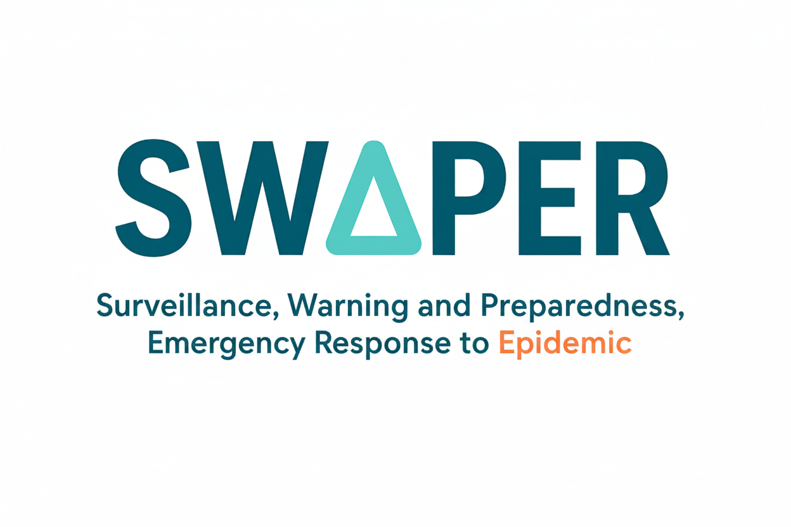

---
format:
  html:
    toc: false
execute:
  echo: false
engine: knitr
---

```{=html}
<style>
/* Mở rộng nội dung */
main {
    max-width: 100%;
}

/* Bố cục logo + thông tin */
.header-container {
    display: flex;
    align-items: center;
    gap: 20px;
    margin-bottom: 20px;
}
.header-logo {
    width: 150px;
    height: 150px;
    border-radius: 50%;
    object-fit: cover;
}
.header-info {
    flex-grow: 1;
}

/* Bố cục nhóm staff */
.team-container {
    display: flex;
    flex-wrap: wrap;
    justify-content: center;
    gap: 20px;
    max-width: 800px;
    margin: auto;
}

.member {
    text-align: left;
    background-color: #e6f7ff;
    color: #000;
    padding: 15px;
    border-radius: 10px;
    display: flex;
    flex-direction: column;
    align-items: flex-start;
}

.leader {
    width: 100%;
    background-color: #f0f8ff;
    color: #000;
    padding: 20px;
    border-radius: 10px;
    display: flex;
    align-items: center;
    gap: 20px;
    justify-content: space-between;
    flex-direction: row-reverse;
}

@media (prefers-color-scheme: dark) {
    .member {
        background-color: #1e1e1e;
        color: #fff;
    }

    .leader {
        background-color: #2b2b2b;
        color: #fff;
    }
}

/* Hàng 4 người */
.row1 {
    width: calc(25% - 20px);
    min-width: 180px;
}

/* Hàng 4 người */
.row2 {
    width: calc(25% - 20px);
    min-width: 180px;
}

/* Hàng 4 người */
.row3 {
    width: calc(25% - 20px);
    min-width: 180px;
}

/* Ảnh đại diện */
.avatar {
    width: 100px;
    height: 100px;
    border-radius: 50%;
    object-fit: cover;
}

.leader-info {
    flex-grow: 1;
    text-align: left;
}

/* Căn trái toàn bộ nội dung của Staff */
.member h3,
.member p {
    text-align: left;
    width: 100%;
}
</style>

<!-- Bố cục logo + thông tin -->
<div class="header-container">
    
    <div class="header-info">
        <h2>Department of Surveillance, Warning and Preparedness, Emergency Response 🏡</h2>
        <p><strong>Established:</strong> June, 2023</p>
        <p><strong>Affiliation:</strong> Ho Chi Minh Center for Diseases Control</p>
        <p>The Department of Surveillance, Warning, and Preparedness for Epidemic Response (SWAPER) monitors and forecasts epidemic trends, assesses risks, and issues alerts. It coordinates actions across all administrative levels, enhances the quality of disease surveillance and warning systems, and manages Ho Chi Minh City’s Emergency Operations Centre.</p>
    </div>
</div>
```

# 🔹 **Members**

```{=html}
<div class="team-container">
    <!-- Leader -->
    <div class="leader">
        
        <div class="leader-info">
            <h3>Lan Truong</h3>
            <p><strong>Position:</strong> Head of Department of Surveillance, Warning and Preparedness, Emergency Response</p>
            <p><strong>Major:</strong> Master of Public Health</p>
        </div>
    </div>

    <!-- Staff (4 người hàng trên) -->
    <div class="member row1">
        
        <h3>An Tran</h3>
        <p><strong>Major:</strong> Doctor of Preventive Medicine</p>
        <p>Data analysis and forecasting, Risk assessment (Modeling team)</p>
    </div>
    <div class="member row1">
        
        <h3>Anh Huynh</h3>
        <p><strong>Major:</strong> Doctor of Preventive Medicine</p>
        <p>Data analysis and forecasting, Risk assessment (Modeling team)</p>
    </div>
    <div class="member row1">
        
        <h3>Diem Le</h3>
        <p><strong>Major:</strong> Doctor of Preventive Medicine</p>
        <p>Surveillance System, Data analysis and forecasting (Modeling team)</p>
    </div>
    <div class="member row1">
        
        <h3>Thu Pham</h3>
        <p><strong>Major:</strong> Bachelor of Public Health</p>
        <p>Data analysis and forecasting, Risk assessment (Modeling team)</p>
    </div>

    <!-- Staff (4 người hàng dưới) -->
    <div class="member row2">
        
        <h3>Khang Huynh</h3>
        <p><strong>Major:</strong> Doctor of Preventive Medicine</p>
        <p>Data analysis and forecasting, Prepare to respond to emergencies(EOC team)</p>
    </div>
    <div class="member row2">
        
        <h3>Vy Tran</h3>
        <p><strong>Major:</strong> Doctor of Preventive Medicine</p>
        <p>Prepare to respond to emergencies, RRT (EOC team)</p>
    </div>
    <div class="member row2">
        
        <h3>Ngoc Dinh</h3>
        <p><strong>Major:</strong> Doctor of Preventive Medicine</p>
        <p>Prepare to respond to emergencies, RRT (EOC team)</p>
    </div>
    <div class="member row2">
        
        <h3>Le Tran</h3>
        <p><strong>Major:</strong> Doctor of Preventive Medicine</p>
        <p>Prepare to respond to emergencies, RRT (EOC team)</p>
    </div>
    
<!-- Staff (4 người hàng dưới) -->
    <div class="member row3">
        
        <h3>Tuyen Pham</h3>
        <p><strong>Major:</strong> Doctor of Preventive Medicine</p>
        <p>Surveillance, warning epidemic</p>
    </div>
    <div class="member row3">
        
        <h3>Quan Truong</h3>
        <p><strong>Major:</strong> Doctor of Preventive Medicine</p>
        <p>Surveillance, warning epidemic</p>
    </div>
    <div class="member row3">
        
        <h3>Vinh Tran</h3>
        <p><strong>Major:</strong> Bachelor of Public Health</p>
        <p>Surveillance, warning epidemic</p>
    </div>
    <div class="member row3">
        
        <h3>Nhon Nguyen</h3>
        <p><strong>Major:</strong> Bachelor of Public Health</p>
        <p>Prepare to respond to emergencies, RRT (EOC team)</p>
    </div>
</div>
```
