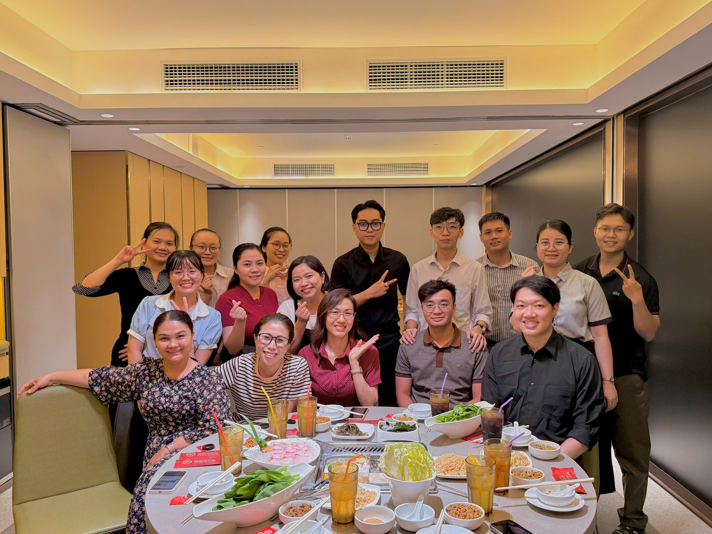

## Meeting with OUCRU

On July 02, 2025, the SWAPER development team held a formal meeting with representatives from the Oxford University Clinical Research Unit (OUCRU) in Ho Chi Minh City. This was one of the initial steps in building a long-term partnership between the two organizations, centered around infectious disease surveillance and applied epidemiological research. 

The meeting provided an opportunity for both sides to discuss key challenges in early warning systems, explore local data collection needs at the district level, and share perspectives on the use of artificial intelligence in outbreak detection and prediction. OUCRU shared their experience with previous research projects, while SWAPER presented their ongoing efforts to digitize surveillance workflows and develop integrated platforms for real-time monitoring.

The atmosphere of the meeting was open and collaborative, fostering mutual understanding and laying the groundwork for future joint initiatives. As of July 2025, the discussions from this meeting have helped shape several shared projects and contributed to a growing network of partners committed to improving public health systems in Vietnam.

## Meeting Highlight

This meeting marked a promising beginning for deeper scientific collaboration and set the tone for more frequent technical exchanges and co-designed research activities.