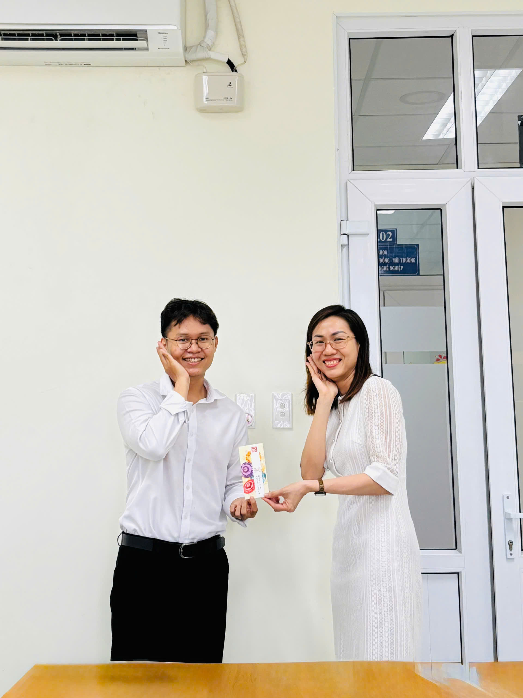

## The Outstanding Presentation award

At any organization, expertise and the ability to share knowledge effectively play a vital role in building a strong, capable team. At our department, internal workshops are not only a learning opportunity but also a platform for individuals to showcase their strengths, inspire others, and contribute to the collective development of the team.

For Quarter 2 of 2025, Mr. Khang has been named the Outstanding Presenter, thanks to his impressive performance during a recent workshop that received overwhelmingly positive feedback from attendees.

🌱 This award is not only a well-deserved recognition for Mr. Khang but also a source of motivation for all of us to continue learning, sharing, and growing together.

Once again, congratulations to Mr. Khang! We look forward to more outstanding presentations in the quarters to come.

