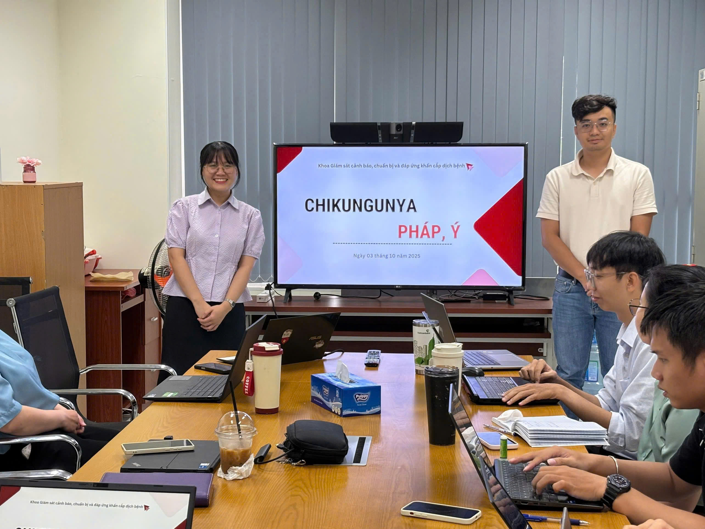

The Department of Surveillance, Warning, Preparedness, and Emergency Response organized an internal workshop to update team members on the current Chikungunya situation in France and Italy, where an increase in reported cases has recently been observed.

During the session, participants reviewed epidemiological trends in both countries and discussed the key factors contributing to the rise in cases, including the expanding distribution of Aedes albopictus, the impact of climate change creating favorable conditions for vector breeding, and high volumes of international travel during the summer season.

This activity strengthened the team’s understanding of Chikungunya transmission risks and supported the department’s early warning efforts.

::: {.callout-note appearance="minimal"}
[Access the full lecture notes and slides at here  ](../documents/workshop/L2_Chikungunya.pdf)
:::