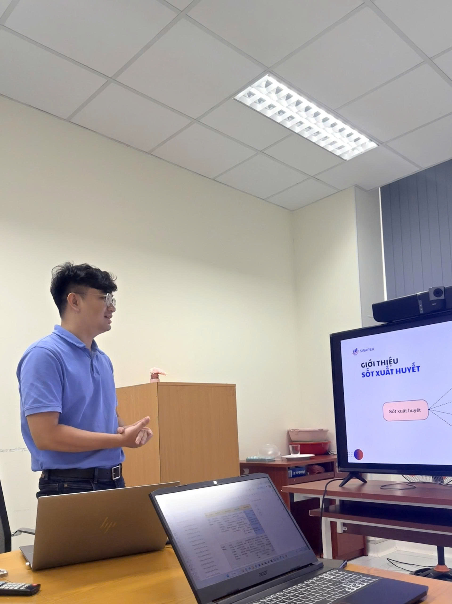

The Department of Surveillance, Warning, Preparedness, and Emergency Response recently held a workshop to present the research concept on the time-varying reproduction number (Rt) in Dengue with representatives from OUCRU.

During the session, the department introduced its proposed study on estimating Rt and its potential application in disease surveillance. Both sides discussed initial steps for collaboration, including research design, data sharing, and strengthening analytical capacity in epidemiology.

::: {.callout-note appearance="minimal"}
[Access the full lecture notes and slides at here](../documents/workshop/L3_RtDengue.pdf)
:::