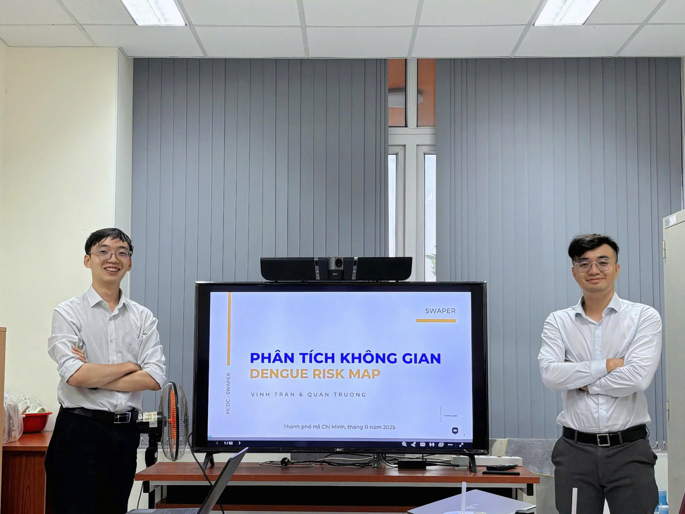

Recently, the Department organized a workshop on “Spatial Analysis” with the participation of members from the Surveillance and Early Warning Division (GSCB). The session provided foundational knowledge on spatial analysis, the development of dengue risk maps, and various approaches for applying spatial modeling in epidemiology.

During the workshop, participants were introduced to an overview of key spatial analysis techniques and global examples of risk-mapping approaches. These insights helped identify lessons learned and inform directions for developing a risk map tailored to the context of Ho Chi Minh City. Members also engaged in active discussions on data application, spatial modeling, and practical implementation for dengue.

The department organized a workshop to introduce Risk Map, a tool that supports visualization, management, and prediction of infectious disease risks based on case data. The tool displays spatial risk distribution, helping identify priority areas for investigation and informing decision-making in surveillance and outbreak response activities.

Risk Map integrates multiple data sources, including case data, population density, growth patterns, and other transmission-related factors. It visualizes risk levels through graded color scales, incorporates hotspots and the growthRate indicator for early warning, and supports prioritization of resources such as vaccines and healthcare personnel.

The workshop provided an overview of Risk Map’s potential applications in analysis and decision support, contributing to improved effectiveness in disease prevention and control.

::: {.callout-note appearance="minimal"}
[Access the full lecture notes and slides at here  ](../documents/worksL4_SpatialAnalysis.pdf.pdf)
:::
