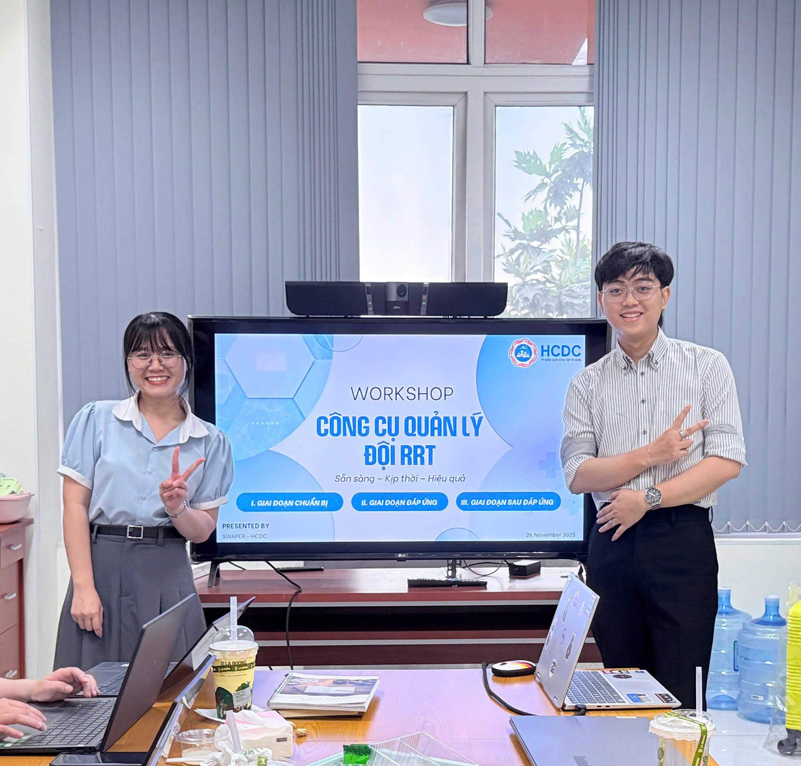

On 26 November 2025, the Department of … organized a workshop to introduce the Rapid Response Team (RRT) Management Tool, designed to support data management and coordination activities during public health emergencies.

The workshop focused on two main components:
-   An overview of activities that the tool can support across the three phases: preparedness, response, and post-response.

-   A feature demonstration, showcasing how the tool operates and the practical workflow for users.

-   The session helped participants gain a clearer understanding of the tool’s potential applications and provided direction for establishing and deploying the RRT in the near future.

::: {.callout-note appearance="minimal"}
[Access the full lecture notes and slides at here  ](../documents/worksL5_ManagementRRT.pdf.pdf)
:::