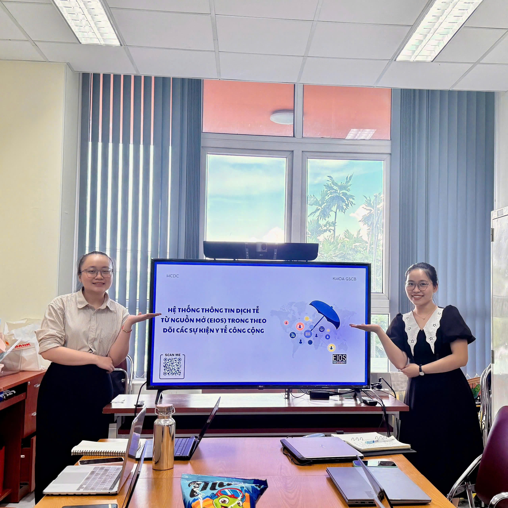

The Department of Surveillance, Warning, Preparedness, and Emergency Response organized an internal workshop on the Epidemic Intelligence from Open Sources (EIOS) system to strengthen the team’s capacity in early detection of public health events.

During the session, members were introduced to how EIOS collects, aggregates, and filters information from various open sources, including news outlets, social media, and online platforms. The workshop also focused on how to use EIOS to identify unusual signals, monitor disease trends, and support early warning activities.

This workshop enhanced the team’s skills in utilizing open-source intelligence, contributing to more effective public health surveillance and timely response to emerging risks.

::: {.callout-note appearance="minimal"}
[Access the full lecture notes and slides at here](../documents/workshop/L6_EIOS.pdf)
:::