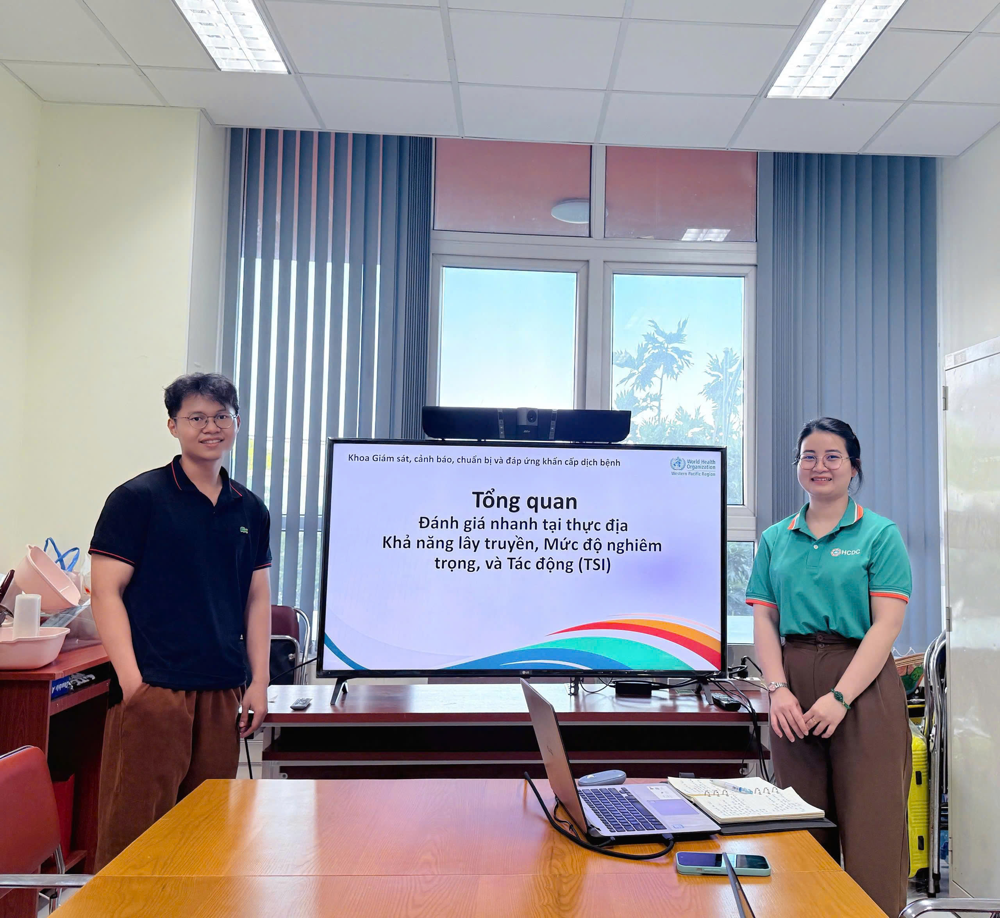

The Department recently organized a workshop titled “Transmission Assessment” with the participation of staff members across the unit. The session focused on providing foundational knowledge and methodologies for evaluating the transmissibility of infectious diseases to support surveillance and outbreak response.

The workshop introduced key concepts such as the reproduction number (R), generation time, and other indicators used to analyze disease transmission dynamics. The reporting team also presented methods for estimating time-varying R, analyzing epidemiological trends, and interpreting results to inform decision-making.

Participants engaged in active discussions on the applicability of each method in real-world settings, including assessing outbreak risk, forecasting epidemic trends, and supporting resource prioritization during response activities.

The workshop concluded with a shared direction to strengthen the use of transmission-assessment methods in routine surveillance, contributing to improved forecasting capacity and more effective disease control.

::: {.callout-note appearance="minimal"}
[Access the full lecture notes and slides at here  ](../documents/worksL7_TSI.pdf.pdf)
:::