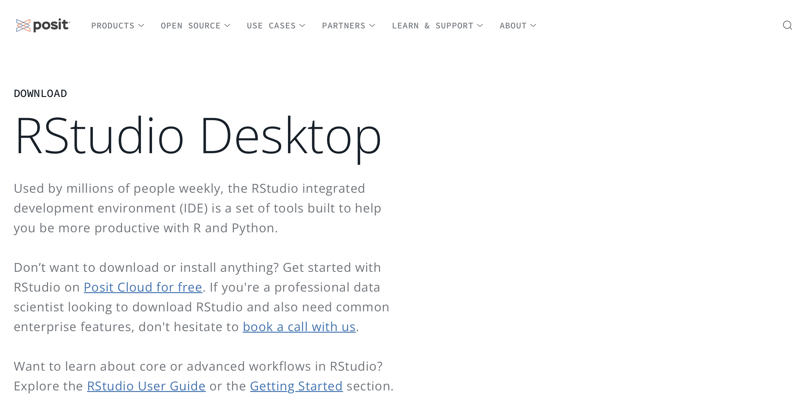

::: center-text
[🚀 Presentation](slide_r01.html){.btn .btn-outline-secondary style="border-radius: 12px;"}
:::

# Introduction about R

## What is R?

-   R is a programming language developed by Professor Robert Gentleman and Professor Ross Ihaka at the University of Auckland^[1](https://drthinhong.com/r4babies/references.html#ref-ihaka1996)^. The name R is derived from the first letters of the two authors' names (Robert and Ross).

-   For statistical computation and data visualization.

-   Includes a basic part (built-in when installing R) and extensions through packages

## Programming language

-   A programming language is a set of instructions that tell a computer to perform certain tasks.

-   Users communicate and converse with computers by entering sentences (code) like chatting with the computer, so that the computer understands and does exactly what the person wants.

## Using R because

-   Free, constantly updated.

-   Great for statistics and graphics.

-   Easy to store commands and re-execute.

-   Should use RStudio instead of basic R.

-   Completely self-taught from internet sources.

# R and RStudio

+-------------------------------------------------------------------------------------------------------------------------------------------------------+-----------------------------------------------------------------------------------------------------------+
| R                                                                                                                                                     | RStudio                                                                                                   |
+=======================================================================================================================================================+===========================================================================================================+
| -   is a programming language                                                                                                                         | -   is an integrated development environment (IDE) or simply a software to write R code more efficiently. |
|                                                                                                                                                       |                                                                                                           |
| -   After installing R, we open it and see an interface like a blank chat box. This chat box is where we write code to communicate with the computer. |                                                                                                           |
+-------------------------------------------------------------------------------------------------------------------------------------------------------+-----------------------------------------------------------------------------------------------------------+

## Installation R

R Official Website: <https://www.r-project.org>

{fig-align="center"}

## Installation R-Studio

RStudio Official Website: <https://posit.co/download/rstudio-desktop/>

R must be installed before RStudio can be installed.

{fig-align="center"}

# Popular Applications of R

## Data analysis and visualization

-   R provides many powerful libraries like `ggplot2`, `dplyr`, `tidyverse` for data processing and visualization.
-   Commonly used in scientific, economic, medical and business research to analyze data and generate reports.

## Statistics and hypothesis testing

-   Supports statistical methods such as linear regression, t-test, ANOVA, and many other statistical models.
-   Suitable for academic research and in-depth data analysis.

## **Machine Learning**

-   There are libraries like `caret`, `randomForest`, `e1071`, `xgboost` for building predictive models.
-   R is commonly used to develop and evaluate machine learning models.

## **Big Data Analytics**

-   R can integrate with Apache Spark through `sparklyr`, which helps in big data processing.
-   Combining SQL, NoSQL for large-scale data analysis.

## Data science and automated reporting

-   R supports dynamic reporting with `R Markdown`, which helps automate data reporting.
-   R Shiny allows building interactive web applications to present data.

## Medicine and Biology

-   Supporting epidemiological research and disease modeling

# Git and GitHub in R

## Git {width="27"}

-   Git is an open source, version control system (VCS) whose purpose is to track changes to files in a repository and provide the ability to roll back to previous versions (including changes in open source code for computational models and algorithms over time).

-   Git is a local software. You do not need GitHub for Git to work. You can use Git independently.

## GitHub

-   GitHub is a cloud-based service for hosting Git.
-   Acts as a remote server for Git.
-   Web-based interface, free and public.

## **Repository**

Contains a collection of files and folders, records the history of changes, tracks their status and versions. There are two types:

-   **Remote repository:** Stored on a remote server, shared among multiple team members.

-   **Local repository:** Stored on a user's personal computer.

## GitHub Desktop {width="27"}

-   **GitHub Desktop** is a software that makes it easier for you to use Git. It is a software built by GitHub, again, separate from Git.
-   **Advantages:**
    -   Keeps things simple and only provides commonly used Git functionality.
    -   Reduces the chance of you making mistakes when using Git.
    -   Integrates directly with GitHub, making authentication easier.

# Products from GitHub and R

## Website design to introduce Faculty and course information

::::: columns
::: {.column width="50%"}
{width="100%"}
:::

::: {.column width="50%"}
{width="100%"}
:::
:::::

## Presenting analysis results, warnings, and epidemic forecasting

::::: columns
::: {.column width="50%"}

:::

::: {.column width="50%"}

:::
:::::

## **Deploying Dashboard**

