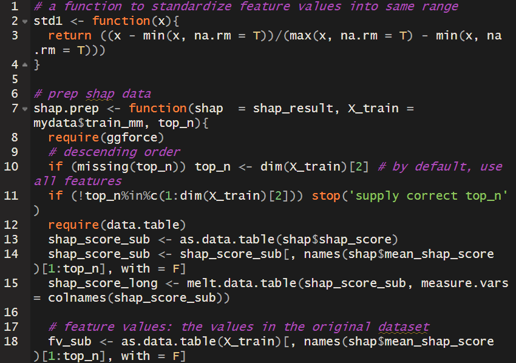
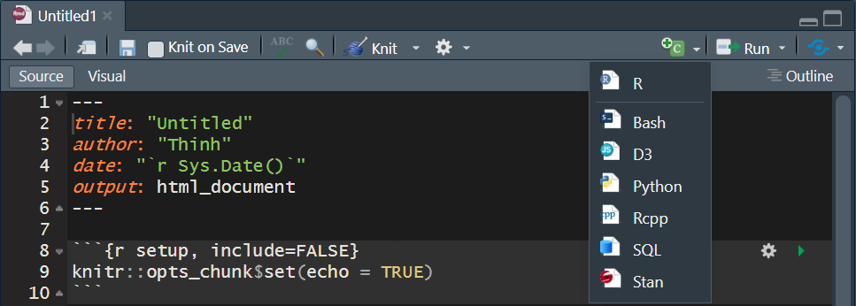
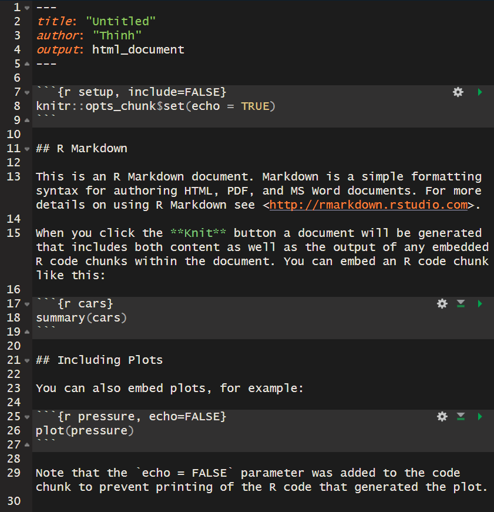
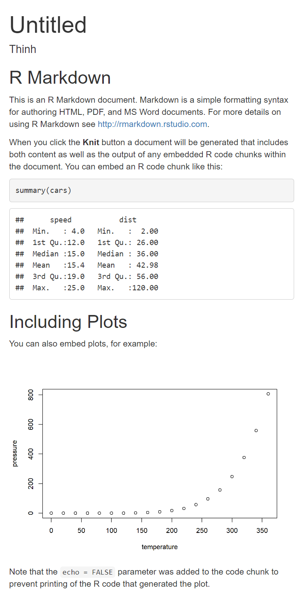
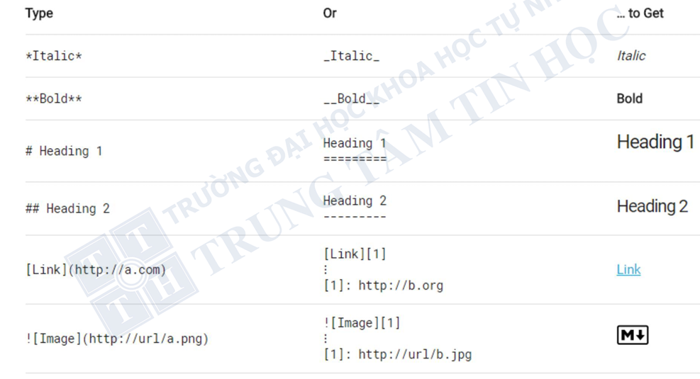
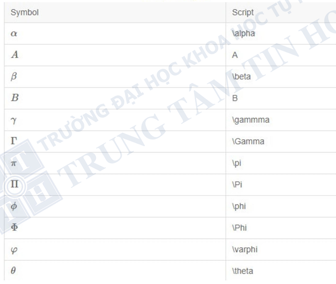
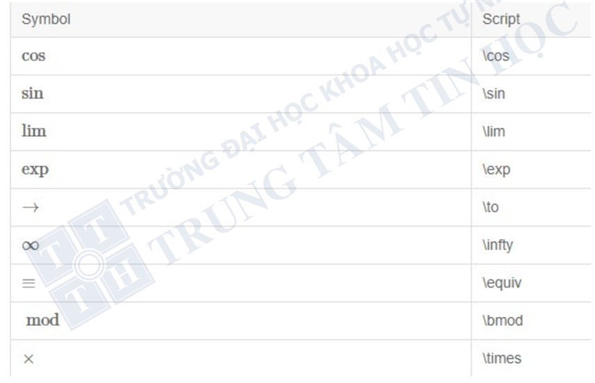
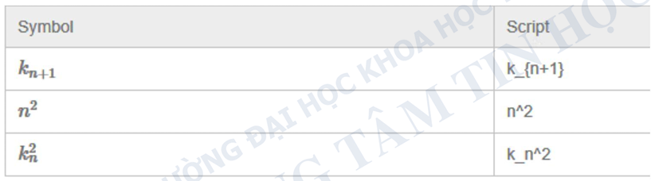
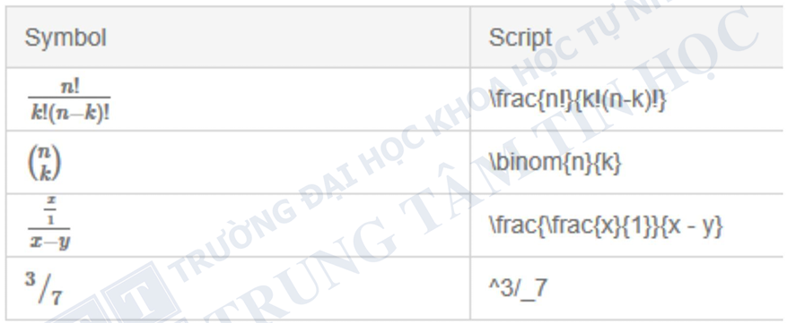

::: center-text
[🚀 Presentation](slide_r01.html){.btn .btn-outline-secondary style="border-radius: 12px;"}
:::

# Giới thiệu về R

## R là gì?

-   R là một ngôn ngữ lập trình được phát triển bởi GS. Robert Gentleman và GS. Ross Ihaka tại Đại học Auckland^[1](https://drthinhong.com/r4babies/references.html#ref-ihaka1996)^. Tên gọi R được đặt theo chữ cái đầu của tên 2 tác giả (Robert và Ross).

-   Để tính toán thống kê và trực quan hóa dữ liệu.

-   Bao gồm phần cơ bản (tích hợp sẵn khi cài đặt R) và phần mở rộng thông qua các gói (packages)

## Ngôn ngữ lập trình

-   Ngôn ngữ lập trình là một tập hợp các hướng dẫn để yêu cầu máy tính thực hiện một số tác vụ nhất định.

-   Người dùng giao tiếp, đối thoại với máy tính bằng cách nhập những câu văn (code) giống như chat với máy tính, để máy hiểu và làm đúng những gì con người muốn

## Nên sử dụng R vì

-   Miễn phí, liên tục cập nhật

-   Rất tốt trong xử lý thống kê và vẽ đồ họa

-   Lưu trữ câu lệnh và thực hiện lại dễ dàng

-   Nên sử dụng RStudio thay vì R cơ bản

-   Hoàn toàn có thể tự học từ nguồn internet

# R và RStudio

+----------------------------------------------------------------------------------------------------------------------------------------------------------+------------------------------------------------------------------------------------------------------------------------------------------------------+
| R                                                                                                                                                        | RStudio                                                                                                                                              |
+==========================================================================================================================================================+======================================================================================================================================================+
| -   là ngôn ngữ lập trình                                                                                                                                | -   là một môi trường phát triển tích hợp (integrated development environment hay IDE) hay nói đơn giản là một phần mềm để viết code R hiệu quả hơn. |
|                                                                                                                                                          |                                                                                                                                                      |
| -   Sau khi cài R, chúng ta mở lên sẽ thấy giao diện giống như một khung chat trống. Khung chat này là nơi chúng ta viết code để giao tiếp với máy tính. |                                                                                                                                                      |
+----------------------------------------------------------------------------------------------------------------------------------------------------------+------------------------------------------------------------------------------------------------------------------------------------------------------+

## Installation R

Trang web chính thức của R: <https://www.r-project.org>

{fig-align="center"}

## Installation R-Studio

-   Trang web chính thức của R-Studio: <https://posit.co/download/rstudio-desktop/>

-   Cần cài đặt R trước khi cài RStudio

{fig-align="center"}

# Ứng dụng phổ biến của R

## Phân tích và trực quan hóa dữ liệu

-   R cung cấp nhiều thư viện mạnh mẽ như `ggplot2`,`dplyr`,`tidyverse`để xử lý và trực quan hóa dữ liệu.

-   Thường được sử dụng trong nghiên cứu khoa học, kinh tế, y tế và kinh doanh để phân tích dữ liệu và tạo báo cáo.

## Thống kê và kiểm định giả thuyết

-   Hỗ trợ các phương pháp thống kê như hồi quy tuyến tính, kiểm định t-test, ANOVA, và các mô hình thống kê khác.

-   Phù hợp cho nghiên cứu học thuật và phân tích dữ liệu chuyên sâu.

## Machine Learning

-   Có các thư viện như`caret`,`randomForest`,`e1071`,`xgboost` giúp xây dựng mô hình dự đoán.

-   R thường được dùng để phát triển và đánh giá các mô hình học máy.

## Big Data Analytics

-   R có thể tích hợp với Apache Spark thông qua `sparklyr`, giúp xử lý dữ liệu lớn.

-   Kết hợp SQL, NoSQL để phân tích dữ liệu quy mô lớn.

## Khoa học dữ liệu và báo cáo tự động

-   R hỗ trợ tạo báo cáo động với `R Markdown`, giúp tự động hóa báo cáo dữ liệu.

-   R Shiny cho phép xây dựng ứng dụng web tương tác để trình bày dữ liệu.

## Y học và sinh học

-   Hỗ trợ nghiên cứu dịch tễ học, mô hình hóa bệnh tật.

# Git và GitHub trong R

## Git {width="27"}

Git là một phần mềm mã nguồn mở, quản lý phiên bản (Version Control System - VCS), mục đích của nó là theo dõi các thay đổi của tệp trong một kho lưu trữ và cung cấp khả năng quay lại phiên bản trước đó (bao gồm các thay đổi trong mã nguồn mở cho các mô hình tính toán, thuật toán theo thời gian).

Git là một phần mềm hoạt động cục bộ. Bạn không cần GitHub để Git có thể hoạt động. Bạn có thể sử dụng Git độc lập.

## GitHub

GitHub là một dịch vụ dựa trên đám mây để lưu trữ kho lưu trữ Git, mục đích chính của nó là lưu trữ và/hoặc chia sẻ dự án Git của bạn với các cộng tác viên trên đám mây.

Giao diện dưới dạng Web-based.

Miễn phí và công khai.

## Repository

**Kho lưu trữ (Repository):** Chứa một tập hợp các tệp và thư mục, ghi lại lịch sử thay đổi, theo dõi trạng thái và các phiên bản của chúng. Có hai loại:

-   **Kho lưu trữ từ xa (Remote repository):** Lưu trữ trên máy chủ từ xa, được chia sẻ giữa nhiều thành viên trong nhóm.

-   **Kho lưu trữ cục bộ (Local repository):** Lưu trữ trên máy tính cá nhân của người dùng.

## GitHub Desktop {width="27"}

**GitHub Desktop** là một phần mềm giúp bạn sử dụng Git dễ dàng hơn. Nó là một phần mềm được xây dựng bởi GitHub.

**Ưu điểm:**
    -   Đơn giản hóa mọi thứ và chỉ cung cấp các chức năng thường được sử dụng của Git.
    
    -   Giảm khả năng bạn sẽ mắc lỗi khi sử dụng Git.
    
    -   Tích hợp trực tiếp với GitHub, giúp xác thực dễ dàng hơn.

# Sản phẩm từ GitHub

## Thiết kế Website giới thiệu Khoa, thông tin khóa học

::::: columns
::: {.column width="50%"}
{width="100%"}
:::

::: {.column width="50%"}
{width="100%"}
:::
:::::

## Trình bày kết quả phân tích, cảnh báo, dự báo dịch

::::: columns
::: {.column width="50%"}

:::

::: {.column width="50%"}

:::
:::::

## **Thiết kế Dashboard**

## R script

-   Các đoạn hội thoại giữa chúng ta và máy tính có thể được lưu lại bằng file R Script `(.r)` hoặc R Markdown `(.rmd)` files.

-   Gần đây có thêm Quarto `(.qmd)` mở rộng hơn những gì R Markdown có thể làm.

-   Vì cách viết Quarto **khá giống R Markdown**, nên chúng ta sẽ tập trung vào học R Markdown cơ bản.

## R script

Tạo R Script bằng cách vào menu `File > New File > R Script`.

R Script là file chứa các câu lệnh R và những dòng chú thích ngắn gọn về câu lệnh (comments). Có 2 cách để comment:

-   Viết dấu `#` đầu dòng để xác định dòng này là comment.

-   Viết dấu `#` ở cuối dòng lệnh.

## R script

## R Markdown

-   Tạo R Markdown bằng cách vào menu `File > New File > R Markdown`.

-   R Markdown là công cụ để tạo ra tài liệu tự động.

-   Trong file R Markdown chứa code R xen kẽ với văn bản mô tả, bảng, biểu đồ… có thể xuất ra nhiều loại định dạng như `.docx, .pdf, .html, .pptx`.

## R Markdown

**YAML header**: nằm ở trên cùng trong và ngăn cách với phần còn lại bằng cặp dấu `---`. Phần này để mô tả tiêu đề tài liệu, tác giả, ngày tháng, định dạng mong muốn.

**Văn bản**: phần diễn giải cho tài liệu, gồm các đề mục và chữ diễn giải viết theo ngôn ngữ

-   Đề mục được đánh dấu bằng dấu `#` và các đề mục nhỏ hơn thì tăng thêm số dấu `#` như `##`, `###`.

-   Phải xuống hàng **2 lần** để viết hàng mới trong văn bản.

**Đoạn code (code chunks)**: là nơi để viết code và xuất ra các kết quả mong muốn. Code chunks của R được đặt trong cặp dấu: 

## R Markdown

-   Để tạo code chunk chúng ta nhấn tổ hợp phím tắt `Ctrl + Alt + I`, hoặc nhấn vào icon này trên thanh công cụ, chọn R: 

-   Ví dụ có file R Markdown sau: 

## R Markdown

-   Khi `knit` file R Markdown trên sẽ tạo ra file báo cáo sau với đầy đủ tiêu đề, đề mục, bảng kết quả, biểu đồ… giống như được tạo ra từ 1 chương trình soạn thảo văn bản như Word.
-   Để knit file R Markdown thì chọn kí hiệu knit trên thanh công cụ: 

## R Markdown

## R Markdown

## R Markdown

## R Markdown

