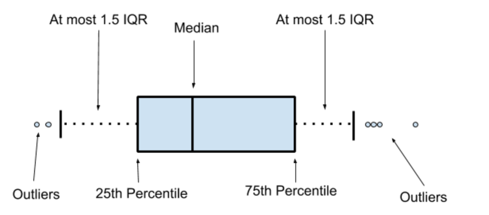

::: center-text
[📎 covid_cases](data/covid_cases.rds){.btn .btn-outline-secondary style="border-radius: 12px;"} [📎 vaccine_data](data/vaccine_data.xlsx){.btn .btn-outline-secondary style="border-radius: 12px;"}[📎 life-exp](data/life-exp.csv){.btn .btn-outline-secondary style="border-radius: 12px;"}[📎 linelist-raw](data/linelist-raw.dta){.btn .btn-outline-secondary style="border-radius: 12px;"}
:::

## Xác định đường dẫn

-   **Path** là vị trí, hay địa chỉ, hay đường dẫn lưu file data trong máy tính

:::: fragment
::: callout-tip
Trong Windows, khi copy path vào R cần sửa lại theo 1 trong 2 cách sau:

-   Sửa tất cả dấu `\` thành `/`: `C:/Documents/Github/R-Together/day1/data`
-   Sửa tất cả dấu `\` thành `\\`: `C:\\Documents\\Github\\R-Together\\day1\\data`
:::
::::

## Đường dẫn tuyệt đối

-   Trong ví dụ trên, `C:/Documents/Github/R-Together/day1/data` là đường dẫn tuyệt đối (absolute path).
-   Là path đầy đủ từ đầu ổ đĩa cho đến file hay folder hiện tại.

## Đường dẫn tương đối

-   Mỗi máy sẽ lưu ở 1 đường khác nhau, do đó nếu sử dụng đường dẫn tuyệt đối để làm việc nhóm thì sẽ gặp khó khăn.

-   Là path ngắn gọn hơn, có thể từ folder đến file cần mở `day1/data` (relative path).

-   Nếu dùng Github, đường dẫn tương đối dễ dàng cho việc chia sẻ code `~Github/R-Together/day1/data`.

## Quy tắc đặt tên file

Để tránh bị lỗi trong quá trình sử dụng R, nên đặt tên files, folders theo các quy tắc sau:

-   Không đặt tên có dấu tiếng Việt.
-   Không đặt tên quá dài.
-   Không đặt tên có các kí tự đặc biệt như `/`, `\`, `&`, `,` , `(`, `)`, tốt nhất chỉ nên đặt chữ và số.
-   Không đặt tên chữ viết hoa viết thường lẫn lộn, nếu cần thì chỉ đặt theo quy luật camelCase (viết hoa chữ cái đầu của các từ sau từ đầu tiên, ví dụ dataSoiHcm) hoặc PascalCase (viết hoa chữ cái đầu của tất cả các từ, ví dụ `DataSoiHcm`).
-   Không có khoảng trống `" "` trong tên, có thể đặt kiểu camelCase, hoặc sử dụng dấu `-`, `_` thay thế các khoảng trống: ví dụ không dùng tên `data soi HCM 2023.xlsx` mà có thể đặt là `dataSoiHcm2023.xlsx`, hoặc `data-soi-hcm-2023.xlsx`, hoặc `data_soi_hcm_2023.xlsx`.

## Đọc data vào R (Text files)

-   Các file như `.txt`, `.csv`, `.json` đều là text files, là những file mà đọc được bằng **Notepad**

```{r}
df <- read.table(file = "data/life-exp.csv", header = F, sep = ",")
head(df)
```

## Đọc data vào R (Text files)

```{r}
#| results: hide
df <- read.table(file = "data/life-exp.csv", header = T, sep = ",")
head(df)
```

## Đọc data vào R (Binary files)

-   Các file như `.xlsx`, `.dta`, `.sas` đều là binary files, là những file phải đọc bằng phần mềm chuyên dụng.

-   Package `readxl` để đọc file `.xlsx` (hoặc `.xls`).

-   Package `haven` để đọc file `.dta`, `.sas`.

## Đọc data vào R (Binary files)

```{r}
library(readxl)
df <- read_excel(path = "data/vaccine_data.xlsx", sheet = 1)
head(df)
```

## Đọc data vào R (Binary files)

```{r}
library(haven)
df <- read_dta(file = "data/linelist-raw.dta")
head(df)
```

## Tại sao cần làm sạch với R?

-   Có thể được viết thành quy trình kiểm tra dữ liệu tự động, kết hợp thống kê mô tả và trực quan hóa để phát hiện các vấn đề cần làm sạch.

-   Tất cả các bước làm sạch đều được ghi lại.

-   Tiết kiệm thời gian làm sạch dữ liệu mới.

## Đối tượng và câu văn trong R

```{r}
#| echo: true
a <- 2
b <- 2
```

-   `a` là đối tượng, và **2** là giá trị của đối tượng.

-   Nếu a = 3, b = 2, và c = a x b thì kết quả?

::: fragment
```{r}
#| echo: true
a <- 3
b <- 2
c <- a * b
c
```
:::

## Đối tượng và câu văn trong R

-   Đối tượng có thể là giá trị, vectơ, ma trận hoặc data.frame

```{r}
a <- 2 # Giá trị
a <- c(1:4) # Vector
df <- data.frame(a = c(1:4),
                 b = c(2:5)) # Matrix
```

::: fragment
```{r}
df <- readxl::read_xlsx("data/vaccine_data.xlsx")
class(df)
```
:::

## Đối tượng và câu văn trong R

Lệnh hoặc chức năng là những câu văn giao tiếp với máy tính trong R.

```{r}
# tên-câu-lệnh(tên-tham-số = data-đầu-vào hoặc lựa-chọn)
```

-   Tên câu lệnh (): thể hiện ý nghĩa câu lệnh dùng để làm gì.
-   Tên tham số (): yêu cầu chi tiết.
-   Để gán giá trị cho tham số, chúng ta cần sử dụng **=** thay vì sử dụng **\<-**.

## Đối tượng và câu văn trong R

Ví dụ:

```{r}
max(x = df$id, na.rm = TRUE)
```

-   ***Max***: tìm giá trị lớn nhất của 1 biến
-   ***x***: tham số đầu vào, chọn cột *id* trong dữ liệu *df*
-   ***na.rm=TRUE***: loại bỏ giá trị missing cột **id** trước khi tìm giá trị lớn nhất.

:::: fragment
::: callout-tip
Để đọc hướng dẫn sử dụng của một lệnh, hãy nhập ?command-name.
:::
::::

## Làm sạch dữ liệu

Quá trình làm sạch dữ liệu thường bao gồm các bước sau:

-   Làm sạch tên cột.

-   Kiểm tra kiểu dữ liệu.

-   Kiểm tra giá trị.

-   Định dạng bảng theo các quy tắc làm sạch dữ liệu.

-   Nối các bảng (nếu cần).

-   Xử lý dữ liệu lỗi.

## Loại dữ liệu trong R

+--------------+----------------------------------------------------------------------------------------------------+---------------------------------+
| **Classes**  | **Explanation**                                                                                    | **Examples**                    |
+==============+====================================================================================================+=================================+
| `numeric`    | dữ liệu dạng số                                                                                    | 2, 3.14, -1000, 2e6, etc        |
+--------------+----------------------------------------------------------------------------------------------------+---------------------------------+
| `logical`    | dữ liệu dạng đúng/sai **(boolean)** (`TRUE`/`FALSE`)                                               | `TRUE`/`FALSE`                  |
+--------------+----------------------------------------------------------------------------------------------------+---------------------------------+
| `character`  | dữ liệu dạng ký tự (hay còn gọi là string), được đặt trong dấu ngoặc kép `""`.\                    | `"Hello world"`, `"R Together"` |
|              | đối tượng dạng ký tự thì **không thể tính toán**                                                   |                                 |
+--------------+----------------------------------------------------------------------------------------------------+---------------------------------+
| `Date`       | dữ liệu ngày tháng                                                                                 | 2024-12-09, s, etc              |
+--------------+----------------------------------------------------------------------------------------------------+---------------------------------+
| `factor`     | dữ liệu dạng phân loại (categorical)                                                               | sex, economic status, etc       |
+--------------+----------------------------------------------------------------------------------------------------+---------------------------------+
| `data frame` | dữ liệu dạng bảng                                                                                  |                                 |
+--------------+----------------------------------------------------------------------------------------------------+---------------------------------+
| `tibble`     | dữ liệu dạng bảng tương tự như data.frame, sự khác biệt chính là tibble in đẹp hơn trong R console |                                 |
+--------------+----------------------------------------------------------------------------------------------------+---------------------------------+

## Các giá trị đặc biệt

+------------+-------------------------------------------------------------------------------------------------------------------+
| Value      | Description                                                                                                       |
+============+===================================================================================================================+
| `NA`       | Có nghĩa là **Not Available**. Biểu thị các giá trị bị thiếu.                                                     |
+------------+-------------------------------------------------------------------------------------------------------------------+
| `NULL`     | Biểu thị giá trị không xác định/không có. (ví dụ: numb \<- NULL biểu thị giá trị cho biến numb là không xác định) |
+------------+-------------------------------------------------------------------------------------------------------------------+
| `NaN`      | Viết tắt của **Not a Number**. Biểu thị số không thể biểu diễn.                                                   |
+------------+-------------------------------------------------------------------------------------------------------------------+
| `Inf/-Inf` | Dương vô cực/ Âm vô cực                                                                                           |
+------------+-------------------------------------------------------------------------------------------------------------------+

## Chuyển đổi dữ liệu

-   `as.numeric()` chuyển sang **numeric**

-   `as.character()` chuyển sang **character**

-   `as.factor()` chuyển sang **factor**

-   `as.Date()` chuyển sang **Date** (Be carefully)

-   `as.logical()` chuyển sang **logical**

-   `ifelse()` có thể sử dụng để tạo biến mới

-   `is.na()` kiểm tra dữ liệu bị thiếu, trả về kiểu giá trị **logical**

## Làm sạch tên cột

Quy tắc cho tên cột thường bao gồm:

-   Ngắn.

-   Không có khoảng trắng (thay thế bằng dấu gạch dưới `_`).

-   Không có ký tự đặc biệt (`&, #, <, >, …`) hoặc dấu câu.

-   Không bắt đầu bằng số.

Sử dụng `clean_names()` trong gói `janitor` để tự động hóa tên cột.

## Làm sạch tên cột

```{r}
library(janitor)
library(tidyverse)
df %>% colnames()
```

::: fragment
```{r}
df %>% clean_names() %>% colnames()
```
:::

::: fragment
```{r}
df <- df %>% 
  clean_names() %>% # Tự động làm sạch tên cột
  rename( 
    vgb_truoc_24 = vgb_24, # Tên mới = Tên cũ
    vgb_sau_24 = vgb_24_2
  )
```
:::

:::: fragment
::: callout-caution
Nếu bạn không sử dụng `<-` thì R sẽ chỉ trả về kết quả của các câu lệnh nhưng `df` **sẽ không thay đổi**.
:::
::::

## Chuyển đổi dữ liệu

```{r}
str(df)
```

Khi nhập dữ liệu vào R, các cột sẽ tự động được chuyển đổi sang kiểu dữ liệu phù hợp nhất. - `Ngày`: R không thể tự động chuyển đổi sang Ngày vì định dạng này không khớp. - `Giới tính` phải được chuyển đổi thành yếu tố. - `Trạng thái` phải được chuyển đổi thành logic.

## Chuyển đổi dữ liệu

::: fragment
```{r}
date_cols <- c("ngaysinh", "vgb_truoc_24","vgb_sau_24","vgb_1","vgb_2","vgb_3","vgb_4","hg_1","hg_2","hg_3","hg_4","uv_1","uv_2","uv_3","uv_4")

df <- df %>% 
  mutate( # Each column
    gioitinh = as.factor(gioitinh),
    tinhtrang = ifelse(tinhtrang == "theo dõi", TRUE, FALSE)
  ) %>% 
  mutate_at( # Multiple column
    date_cols, 
    dmy
  ) %>% 
  rename(
    theodoi = tinhtrang
  )

str(df)
```
:::

## Lọc dữ liệu

| Ký hiệu    | Mô tả                 |
|------------|-----------------------|
| `x == y`   | x bằng y              |
| `x != y`   | x khác y              |
| `x < y`    | x nhỏ hơn y           |
| `x <= y`   | x nhỏ hơn hoặc bằng y |
| `is.na(x)` | x là giá trị thiếu    |
| `A & B`    | x và y                |
| `A | B`    | x hoặc y              |
| `!`        | không                 |

## Lọc dữ liệu

-   Những người có Quận 2.
-   Những người có `vgb_1` trước ngày 20 tháng 2 năm 2024.
-   Những người có Quận 2 hoặc `vgb_1` trước ngày 20 tháng 2 năm 2024.
-   Những người có Quận 2 và `vgb_1` trước ngày 20 tháng 2 năm 2024.

::: fragment
```{r}
#| results: hide
df %>% filter(huyen == "Quận 2") %>% select(id, huyen)

df %>% filter(vgb_1 < as.Date("2024-02-20")) %>% select(id, vgb_1)

df %>% filter(huyen == "Quận 2" | vgb_1 < as.Date("2024-02-20")) %>% select(id, huyen, vgb_1)

df %>% filter(huyen == "Quận 2" & vgb_1 < as.Date("2024-02-20")) %>% select(id, huyen, vgb_1)
```
:::

## Loại dữ liệu dạng chuỗi

+----------------------+---------------+--------------------------------------+
| **Function**         | **Package**   | **To use**                           |
+======================+===============+======================================+
| `tolower`            | base          | Chữ thường                           |
+----------------------+---------------+--------------------------------------+
| `toupper`            | base          | Chữ in                               |
+----------------------+---------------+--------------------------------------+
| `string_to_title`    | stringr       | Viết hoa chữ cái đầu tiên của mỗi từ |
+----------------------+---------------+--------------------------------------+
| `stri_trans_general` | stringi       | Xóa dấu                              |
+----------------------+---------------+--------------------------------------+

## Loại dữ liệu ngày tháng

+-----------------+--------------+--------------------------------------------+
| **Function**    | **Package**  | **To use**                                 |
+=================+==============+============================================+
| `differtime`    | base         | Tính khoảng cách giữa 2 điểm thời gian     |
+-----------------+--------------+--------------------------------------------+
| `month/year`    | lubridate    | Trả về tháng/ năm                          |
+-----------------+--------------+--------------------------------------------+
| `quarter`       | lubridate    | Chuyển ngày tháng sang quý                 |
+-----------------+--------------+--------------------------------------------+
| `today`         | lubridate    | Trả về ngày tháng hiện tại                 |
+-----------------+--------------+--------------------------------------------+
| `dmy, ymd, mdy` | lubridate    | Chuyển đổi thành nhiều định dạng khác nhau |
+-----------------+--------------+--------------------------------------------+

## Chuyển đổi dữ liệu ngày tháng

-   Tìm trẻ em được tiêm vắc-xin `vgb_2` trong vòng 2 tháng sau khi sinh

::: fragment
```{r}
#| results: hide
# --- Cách 1
df %>% 
  filter(
    # Gọi month để lấy tháng sau đó trừ nhau
    month(vgb_2) - month(ngaysinh)  <= 2
  )

# --- Cách 2
df %>% 
  filter(
    # gọi difftime để tính khoảng cách thời gian
    difftime(vgb_2, ngaysinh, units = "days")/30 <= 2
  )
```
:::

## Kiểm tra dữ liệu

Thông thường bao gồm các hoạt động chính:

-   Kiểm tra giá trị NA.

-   Kiểm tra các giá trị ngoại lai và phạm vi của mỗi cột.

-   Kiểm tra giá trị giữa các cột (nếu cần).

## Kiểm tra giá trị NA

::: fragement
```{r}
sum(c(1, 2, 3, 4, NA))
```
:::

:::: fragment
::: callout-tip
Trong R, NA là một giá trị đặc biệt không thể tính toán hoặc so sánh với các kiểu dữ liệu khác (kết quả luôn trả về NA).
:::
::::

-   Thay thế NA bằng giá trị khác.
-   Xóa các hàng có chứa NA.

## Kiểm tra outliers

Để nhanh chóng kiểm tra xem dữ liệu có chứa giá trị ngoại lai hay không, chúng ta có thể sử dụng **boxplot** để tìm các điểm giá trị cách xa các giá trị còn lại.



:::: fragment
::: callout-tip
Trong nhiều trường hợp, dữ liệu được coi là giá trị ngoại lai vẫn có thể là giá trị hợp lệ và nên được giữ lại để phân tích.

Nếu giá trị ngoại lai là sai, hãy xử lý nó giống như các giá trị bị thiếu.
:::
::::

## Kiểm tra outliers

::: fragement
```{r}
example_outlier <- c(-5,1,3,4,1,2,5,10)
```
:::

::: fragment
```{r}
boxplot(example_outlier)
```
:::

## Tidy data

-   Một tập dữ liệu có các hàng và cột.

-   Mỗi cột là một biến.

-   Mỗi hàng là một quan sát.

-   Mỗi ô chỉ chứa 1 giá trị.

## Tidy data

```{r}
#| echo: false
dff <- readRDS("~/GitHub/swaper/data/covid_cases.rds")
head(dff[, 1:6], 3)
```

**Hoặc**

```{r}
#| echo: false
dff_pivot <- dff %>% pivot_longer(cols = -1, names_to = "country", values_to = "cases")
head(dff_pivot, 3)
```

## Joint table

+----------------+-------------------------------------------------------------------------------------------+---------------------+
| Lệnh           | Mô tả                                                                                     | GIF                 |
+================+===========================================================================================+=====================+
| `left_join()`  | Lấy bảng bên trái làm tham chiếu và tìm kiếm các hàng tương ứng của bảng bên phải để nối. |   |
|                |                                                                                           |                     |
|                | Nếu các hàng không có hàng tương ứng để nối, trả về giá trị **NA**                        |                     |
+----------------+-------------------------------------------------------------------------------------------+---------------------+
| `inner_join()` | Lấy bảng bên trái làm tham chiếu và tìm kiếm các hàng tương ứng của bảng bên phải để nối. |  |
|                |                                                                                           |                     |
|                | Các hàng không có hàng tương ứng để nối **sẽ bị xóa**                                     |                     |
+----------------+-------------------------------------------------------------------------------------------+---------------------+
| `full_join()`  | Giữ lại tất cả các hàng của 2 bảng sau khi nối                                            |   |
|                |                                                                                           |                     |
|                | Các hàng của 2 bảng không thể nối sẽ được thay thế bằng các giá trị **NA**                |                     |
+----------------+-------------------------------------------------------------------------------------------+---------------------+

## Xử lý dữ liệu lỗi

-   Chỉnh sửa giá trị dữ liệu.

-   Lọc trùng.

-   Lọc các hàng theo điều kiện.

## Chỉnh sửa giá trị dữ liệu

-   Giá trị bị thiếu.

-   Dữ liệu **TRUE/FALSE** được hiển thị khác nhau trong dữ liệu gốc (ví dụ: Đánh dấu X hoặc để trống trong tệp excel).

-   Tính đồng nhất của dữ liệu.

`replace_na()`: thay thế giá trị NA bằng giá trị được cung cấp

`is.na()`: dữ liệu trống **NA** có giá trị **TRUE** và ngược lại

`ifelse()`: mã hóa điều kiện đơn giản, nếu có thì không

`case_when()`: mã hóa các giá trị cho các trường hợp nhất định

## Lọc hàng và cột

-   Loại bỏ giá trị bị thiếu.

-   Lọc theo hàng.

-   Lọc theo giá trị.

-   Lọc trùng.

    `left_joint()`, `inner_joint()`, `full_joint()`: nối bảng

    `filter()`: lọc hàng và cột theo điều kiện

    `distinct()`: lọc trùng

## Tidyverse


## Tại sao chọn Tidyverse?

-   Mọi lệnh trong tidyverse đều có chung một cấu trúc và mẫu nhất quán.

-   Code R của bạn có thể sạch hơn và dễ theo dõi hơn so với Based-R.

-   Bạn chỉ cần cài đặt mọi thứ một lần, thay vì nhiều package khác nhau cho những thứ khác nhau.

::: callout-warning
-   Nó chỉ là một tập hợp các R Packages
-   Bạn không cần phải sử dụng tidyverse khi sử dụng R
:::

## Hàm tidyverse thường dùng

```{r}
#| results: hide
install.packages("tidyverse")
```

-   `dplyr::select()`: để chọn các cột từ **df/tibble**
-   `dplyr::mutate()`: để thay đổi hoặc tạo cột mới từ **df/tibble**
-   `dplyr::group_by()` và `dplyr::summarise()`: để nhóm dữ liệu và tóm tắt nó bằng cách sử dụng một hàm, ví dụ: trung bình, tối đa, tối thiểu, tổng
-   `tidyr::pivot_longer()`: để chuyển đổi một df/tibble từ định dạng rộng sang định dạng dài (ít cột hơn, nhiều hàng hơn)
-   `tidyr::pivot_wider()`: để chuyển đổi một df/tibble từ định dạng dài sang định dạng rộng (ít hàng hơn, nhiều cột hơn)

## Piping with `%>%`

```{r}
#| results: hide
grouped_by_gear <- group_by(mtcars, gear)
mean_mpg_by_gear  <- summarise(grouped_by_gear, mean_mpg = mean(mpg))
ungrouped_data <- ungroup(mean_mpg_by_gear)

ggplot(
  data = ungrouped_data,
  aes(x = gear, y = mean_mpg)
) +
  geom_col()
```

-   Đây có phải là là cách viết tốt không? Chúng ta có thể cải thiện nó hơn nữa không?

## Piping with `%>%`

```{r}
#| results: hide
ggplot(
  data = ungroup(summarise(group_by(mtcars, gear), mean_mpg = mean(mpg))),
  aes(x = gear, y = mean_mpg)
) +
  geom_col()
```

**Hoặc**

```{r}
#| results: hide
mtcars %>% 
  group_by(gear) %>% 
  summarise(mean_mpg = mean(mpg)) %>% 
  ungroup() %>% 
  ggplot(aes(x = gear, y = mean_mpg)) +
  geom_col()
```

## Piping with `%>%`

-   Một công cụ mạnh mẽ để thể hiện một chuỗi hành động.

-   Nó giúp bạn viết mã dễ đọc và dễ hiểu hơn.

-   Trong R, bạn có thể chuyển đổi giữa các hàm bằng cách sử dụng toán tử `%>%` hoặc `|>`.

-   Phím tắt: **Cmd+Shift+M** or **Ctrl+Shift+M**.

::: callout-tip
R Together will use `%>%`
:::

## Functions

-   Hàm là một chuỗi mã có thể tái sử dụng.
-   Có thể tạo hàm bằng cú pháp.

```{r}
#| results: hide
function_name <- function(){

# function content

}
```

## Functions

**Ví dụ:** một hàm đơn giản

```{r}
print_hello <- function(){
  print("Hello newbies")
  print("We are SWAPER")
}

print_hello()
```

## Functions

```{r}
#| results: hide
function_name <- function(arg1, arg2){

# function content
  
# values of argument can be accessed simply calling argument name

}
```

## Functions

```{r}
compute_power <- function(base, power){

  base**power
  
}
```

```{r}
#| results: hide
compute_power(5, 2) 
```

```{r}
#| results: hide
compute_power(2, 5)
```

## Functions

```{r}
compute_power(5, 2) 
```

```{r}
compute_power(2, 5) 
```

## Exercise tại lớp

-   Mở file từ đường dẫn `day1/inclass.R`.

-   Import dữ liệu

## Exercise tại lớp

```{r}
covid_cases <- readRDS("data/covid_cases.rds")

case_col <- "cases_chn"

basic_stats <- c(
  min =  min(covid_cases[[case_col]]),
  q1 = quantile(covid_cases[[case_col]], 0.25, names=FALSE),
  median = median(covid_cases[[case_col]]),
  q3 = quantile(covid_cases[[case_col]], 0.75, names=FALSE),
  max = max(covid_cases[[case_col]])
)

basic_stats
```

## Exercise tại lớp

-   Đa số các cột đều có cấu trúc `cases_{country_code}`

-   Tạo function để tính cho các quốc gia khác.

```{r}
#| code-fold: true
compute_stats <- function(data, colname){
  return(
    c(
      min = min(data[[colname]]),
      q1 = quantile(data[[colname]], 0.25, names=FALSE),
      median = median(data[[colname]]),
      q3 = quantile(data[[colname]], 0.75, names=FALSE),
      max = max(data[[colname]])
    )
  )
}
```

## Exercise tại lớp

-   Thay đổi `colname =` là sẽ làm tương tự cho các quốc gia khác.

```{r}
compute_stats(covid_cases, colname = "cases_chn")
```
