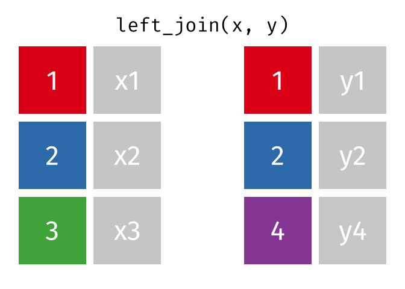

::: center-text
[🚀 Presentation](slide_r02.html){.btn .btn-outline-secondary style="border-radius: 12px;"}[📎 covid_cases](data/covid_cases.rds){.btn .btn-outline-secondary style="border-radius: 12px;"} [📎 vaccine_data](data/vaccine_data.xlsx){.btn .btn-outline-secondary style="border-radius: 12px;"}
:::

## Why cleaning data with R?

-   It can be written into an automated data inspection process, combining descriptive statistics and visualization to detect issues that need cleaning.

-   All cleaning steps are logged.

-   Save time cleaning new data.

## Objective and sentence in R

```{r}
#| echo: true
a <- 2
b <- 2
```

-   **a** is objective, and **2** is value of objective.

-   If put a = 3, b = 2, and c = a x b so results of c?

::: fragment
```{r}
#| echo: true
a <- 3
b <- 2
c <- a * b
c
```
:::

-   Objective is value, vector, matrix or data.frame

::: fragment
```{r}
df <- readxl::read_xlsx("data/vaccine_data.xlsx")
class(df)
```
:::

## Objective and sentence in R

Command or function are sentences in R for communicating with computer.

```{r}
# Function(agruments = data_frame or options)
```

-   Function before the (): what the function to do
-   Agruments put into (): detail requirements
-   To assign value to agruments, we need to use **=** instead of using **\<-**

## Objective and sentence in R

Example:

```{r}
max(x = df$id, na.rm = TRUE)
```

-   ***Max***: maximum value function of variable
-   ***x***: input agrument, choose *id* column in data *df*
-   ***na.rm=TRUE***: eliminate NA value in **id** column before maximizing value.

:::: fragment
::: callout-tip
To read the instruction manual for a command, type ?command-name.
:::
::::

## Process of cleaning data

The process of cleaning data usually includes the following steps:

-   Clean column names.

-   Check datatype.

-   Check values.

-   Format tables according to clean data rules.

-   Join tables (if necessary).

-   Handle error data.

## Data type in R

+--------------+-----------------------------------------------------------------------------------------------------------+---------------------------------+
| **Classes**  | **Explanation**                                                                                           | **Examples**                    |
+==============+===========================================================================================================+=================================+
| `numeric`    | for numerical data, including decimals                                                                    | 2, 3.14, -1000, 2e6, etc        |
+--------------+-----------------------------------------------------------------------------------------------------------+---------------------------------+
| `logical`    | for boolean data (`TRUE`/`FALSE`) **without quotation marks**                                             | `TRUE`/`FALSE`                  |
+--------------+-----------------------------------------------------------------------------------------------------------+---------------------------------+
| `character`  | for text/characters data (also referred to as string)                                                     | `"Hello world"`, `"R Together"` |
+--------------+-----------------------------------------------------------------------------------------------------------+---------------------------------+
| `Date`       | data classified as Date                                                                                   | 2024-12-09, s, etc              |
+--------------+-----------------------------------------------------------------------------------------------------------+---------------------------------+
| `factor`     | for categorical data                                                                                      | sex, economic status, etc       |
+--------------+-----------------------------------------------------------------------------------------------------------+---------------------------------+
| `data frame` | common way for R to store dataset, consists of vectors                                                    |                                 |
+--------------+-----------------------------------------------------------------------------------------------------------+---------------------------------+
| `tibble`     | an “enhanced” version of `data.frame` which is less prone to error and printed more nicely in the console |                                 |
+--------------+-----------------------------------------------------------------------------------------------------------+---------------------------------+

## Special values

+------------+---------------------------------------------------------------------------------------------------------------+
| Value      | Description                                                                                                   |
+============+===============================================================================================================+
| `NA`       | Stands for [Not Available]{.underline}. Indicates missing values.                                             |
+------------+---------------------------------------------------------------------------------------------------------------+
| `NULL`     | Indicates undefined/abscence of value. (e.g. `numb <- NULL` indicates value for variable `numb` is undefined) |
+------------+---------------------------------------------------------------------------------------------------------------+
| `NaN`      | Stands for [Not a Number]{.underline}. Indicates unrepresentable number.                                      |
+------------+---------------------------------------------------------------------------------------------------------------+
| `Inf/-Inf` | Infinity/Negative infinity                                                                                    |
+------------+---------------------------------------------------------------------------------------------------------------+

## Data type convert

-   `as.numeric()` convert to numeric type

-   `as.character()` convert to character type

-   `as.factor()` convert to factor type

-   `as.Date()` convert to Date type (Be carefully)

-   `as.logical()` convert to logical

-   `ifelse()` may be used for create a new variable

-   `is.na()` check NA values according to logical value.

## Clean name of columns

Rules for column names typically include:

-   Short

-   No spaces (replace with underscore `_`).

-   No special characters (`&, #, <, >, …`) or punctuation.

-   Do not start with a number.

Using `clean_names()` in `janitor` package to to automate the column name

## Clean name of columns

```{r}
library(janitor)
library(tidyverse)
df %>% colnames()
```

::: fragment
```{r}
df %>% clean_names() %>% colnames()
```
:::

::: fragment
```{r}
df <- df %>% 
  clean_names() %>% # Clean column name automatically
  rename( 
    vgb_truoc_24 = vgb_24, # new name = old name
    vgb_sau_24 = vgb_24_2
  )
```
:::

:::: fragment
::: callout-caution
If you don't use `<-` then R will only return the results of the statements but the `df` table **will not change**.
:::
::::

## Convert data type

```{r}
str(df)
```

When importing data into R, columns will be automatically converted to the most appropriate datatype. - `Date columns`: R cannot automatically convert to Date because this format does not match. - `Sex column` should be converted to factor. - `Status` should be converted to logical.

## Convert data type

::: fragment
```{r}
date_cols <- c("ngaysinh", "vgb_truoc_24","vgb_sau_24","vgb_1","vgb_2","vgb_3","vgb_4","hg_1","hg_2","hg_3","hg_4","uv_1","uv_2","uv_3","uv_4")

df <- df %>% 
  mutate( # Each column
    gioitinh = as.factor(gioitinh),
    tinhtrang = ifelse(tinhtrang == "theo dõi", TRUE, FALSE)
  ) %>% 
  mutate_at( # Multiple column
    date_cols, 
    dmy
  ) %>% 
  rename(
    theodoi = tinhtrang
  )

str(df)
```
:::

## Filter data

| Character  | Description                  |
|------------|------------------------------|
| `x == y`   | x is equal to y              |
| `x != y`   | x is different from y        |
| `x < y`    | x is less than y             |
| `x <= y`   | x is less than or equal to y |
| `is.na(x)` | x is missing value           |
| `A & B`    | x and y                      |
| `A | B`    | x or y                       |
| `!`        | not                          |

## Filter data

-   Who have District 2
-   Who have `vgb_1` before February 20, 2024
-   Who have District 2 or `vgb_1` before February 20, 2024
-   Who have District 2 and `vgb_1` before February 20, 2024

::: fragment
```{r}
#| results: hide
df %>% filter(huyen == "Quận 2") %>% select(id, huyen)

df %>% filter(vgb_1 < as.Date("2024-02-20")) %>% select(id, vgb_1)

df %>% filter(huyen == "Quận 2" | vgb_1 < as.Date("2024-02-20")) %>% select(id, huyen, vgb_1)

df %>% filter(huyen == "Quận 2" & vgb_1 < as.Date("2024-02-20")) %>% select(id, huyen, vgb_1)
```
:::

## String data type

+----------------------+---------------+------------------------------------------+
| **Function**         | **Package**   | **To use**                               |
+======================+===============+==========================================+
| `tolower`            | base          | Lowercase                                |
+----------------------+---------------+------------------------------------------+
| `toupper`            | base          | Uppercase                                |
+----------------------+---------------+------------------------------------------+
| `string_to_title`    | stringr       | Capitalize the first letter of each word |
+----------------------+---------------+------------------------------------------+
| `stri_trans_general` | stringi       | Remove mark                              |
+----------------------+---------------+------------------------------------------+

## Date data type

+-----------------+--------------+----------------------------------------------+
| **Function**    | **Package**  | **To use**                                   |
+=================+==============+==============================================+
| `differtime`    | base         | Calculate the distance between 2 time points |
+-----------------+--------------+----------------------------------------------+
| `month/year`    | lubridate    | Get motnh/ year                              |
+-----------------+--------------+----------------------------------------------+
| `quarter`       | lubridate    | Change date to quarter                       |
+-----------------+--------------+----------------------------------------------+
| `today`         | lubridate    | Get current date                             |
+-----------------+--------------+----------------------------------------------+
| `dmy, ymd, mdy` | lubridate    | Convert string in various formats to date    |
+-----------------+--------------+----------------------------------------------+

## Date data type

-   Find children vaccinated with `vgb_2` within 2 month of `birth`

::: fragment
```{r}
#| results: hide
# --- Cách 1
df %>% 
  filter(
    # Gọi month để lấy tháng sau đó trừ nhau
    month(vgb_2) - month(ngaysinh)  <= 2
  )

# --- Cách 2
df %>% 
  filter(
    # gọi difftime để tính khoảng cách thời gian
    difftime(vgb_2, ngaysinh, units = "days")/30 <= 2
  )
```
:::

## Check values

Usually includes the main operations: - Check for NA values. - Check for outliers and ranges of each column. - Check values between columns (if necessary).

## Check NA values

::: fragement
```{r}
sum(c(1, 2, 3, 4, NA))
```
:::

:::: fragment
::: callout-tip
In R, NA is a special value that cannot be calculated or compared with other datatypes (the result always returns NA).
:::
::::

-   Replace NA with another value.
-   Remove rows containing NA.

## Check outliers

To quickly check whether the data contains outliers, we can use boxplot to find value points that are far away from the remaining values.


:::: fragment
::: callout-tip
In many cases, data that is considered an outlier may still be a valid value and should be kept for analysis.

If outliers are wrong, handle it as same as missing values.
:::
::::

## Check outliers

::: fragement
```{r}
example_outlier <- c(-5,1,3,4,1,2,5,10)
```
:::

::: fragment
```{r}
boxplot(example_outlier)
```
:::

## Tidy data

-   A dataset with rows and columns.
-   Each column is a variable.
-   Each row is an observation.
-   Each cell contains 1 value only.

## Tidy data

```{r}
#| echo: false
dff <- readRDS("~/GitHub/swaper/data/covid_cases.rds")
head(dff[, 1:6], 3)
```

**OR**

```{r}
#| echo: false
dff_pivot <- dff %>% pivot_longer(cols = -1, names_to = "country", values_to = "cases")
head(dff_pivot, 3)
```

## Joint table

+----------------+---------------------------------------------------------------------------------------------------------+---------------------+
| Function       | Description                                                                                             | GIF                 |
+================+=========================================================================================================+=====================+
| `left_join()`  | Take the left table as the reference, and search for the corresponding rows of the right table to join. |   |
|                |                                                                                                         |                     |
|                | If rows **without corresponding row** to join, leave the **value NA**                                   |                     |
+----------------+---------------------------------------------------------------------------------------------------------+---------------------+
| `inner_join()` | Take the left table as the reference, and search for corresponding rows of the right table to join.     |  |
|                |                                                                                                         |                     |
|                | Rows **without corresponding rows** to join will **be deleted**                                         |                     |
+----------------+---------------------------------------------------------------------------------------------------------+---------------------+
| `full_join()`  | Kêp all rows of 2 tables after joining                                                                  |   |
|                |                                                                                                         |                     |
|                | Rows of 2 tables that **cannot be joined** will be replaced with **NA values**                          |                     |
+----------------+---------------------------------------------------------------------------------------------------------+---------------------+

## Handle error data

-   Edit data values

-   Filter duplicates

-   Filter rows by conditions

## Edit data values

-   Missing values.

-   TRUE/FALSE data is displayed differently in the original data (eg: Marked X or left blank in the excel file).

-   Data uniformity.

`replace_na()`: replace NA values with the provided value `is.na()`: blank data (NA) has TRUE value and vice versa `ifelse()`: simple conditional coding, if yes else no `case_when()`: encode values for certain cases

## Filter rows and columns

-   Remove missing values.

-   Filter by row number.

-   Filter by value.

-   Filter duplicate. `drop_na()`: drop all within NA values `left_joint()`, `inner_joint()`, `full_joint()`: joint tables `filter()`: filter rows and columns with conditions `distinct()`: filter duplicate observations.

## Tidyverse


## Why tidyverse

-   Every function in tidyverse shares a consistent structure and pattern.

-   Your R code may look cleaner and easier to follow, compared to base R.

-   You just need to install everything once, instead of different packages for different things.

::: callout-warning
-   It is just a collection of R packages
-   You don’t have to use tidyverse when using R
:::

## Commonly used tidyverse function

```{r}
#| results: hide
install.packages("tidyverse")
```

-   `dplyr::select()`: to select columns from df/tiblle
-   `dplyr::mutate()`: to change and create columns in a df/tibble
-   `dplyr::group_by()` and `dplyr::summarise()`: to group data and summarise it using a function, e.g. mean, max, min, sum
-   `tidyr::pivot_longer()`: to transform a df/tibble from wide to long format (less columns, more rows)
-   `tidyr::pivot_wider()`: to transform a df/tibble from long to wide format (less rows, more columns)

## Piping with `%>%`

```{r}
#| results: hide
grouped_by_gear <- group_by(mtcars, gear)
mean_mpg_by_gear  <- summarise(grouped_by_gear, mean_mpg = mean(mpg))
ungrouped_data <- ungroup(mean_mpg_by_gear)

ggplot(
  data = ungrouped_data,
  aes(x = gear, y = mean_mpg)
) +
  geom_col()
```

-   Is this a better way to write it? Can we improve it even further?

## Piping with `%>%`

```{r}
#| results: hide
ggplot(
  data = ungroup(summarise(group_by(mtcars, gear), mean_mpg = mean(mpg))),
  aes(x = gear, y = mean_mpg)
) +
  geom_col()
```

**OR**

```{r}
#| results: hide
mtcars %>% 
  group_by(gear) %>% 
  summarise(mean_mpg = mean(mpg)) %>% 
  ungroup() %>% 
  ggplot(aes(x = gear, y = mean_mpg)) +
  geom_col()
```

## Piping with `%>%`

-   A powerful tool to express a sequence of actions.
-   It helps you write code that is easier to read and understand.
-   In R, you can pipe between functions using the `%>%` or `|>` operators.
-   Rstudio shortcut: **Cmd+Shift+M** or **Ctrl+Shift+M**. :::: fragment ::: callout-tip R Together will use `%>%`. ::: ::::

## Functions

-   A function is a reusable sequence of code.
-   It can be created using the syntax.

```{r}
#| results: hide
function_name <- function(){

# function content

}
```

## Functions

Example: a simple function

```{r}
print_hello <- function(){
  print("Hello newbies")
  print("We are SWAPER")
}

print_hello()
```
