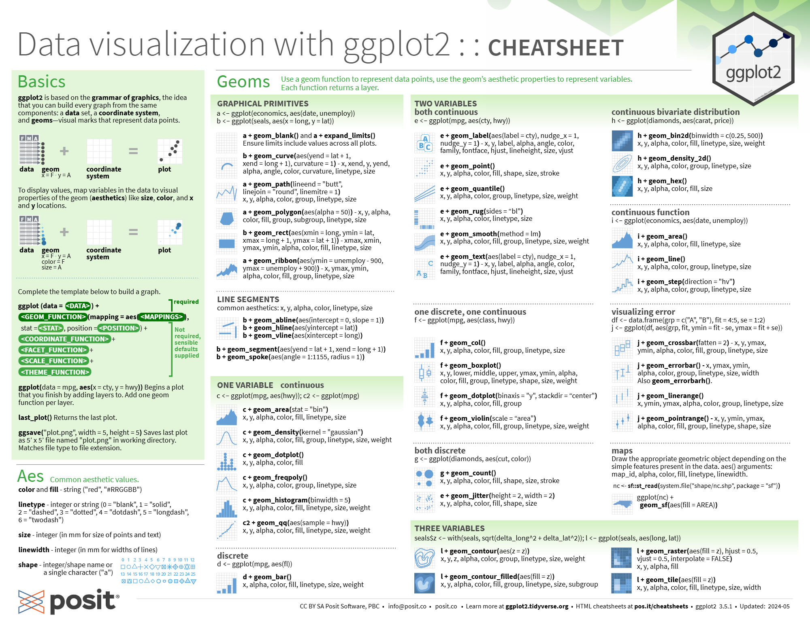
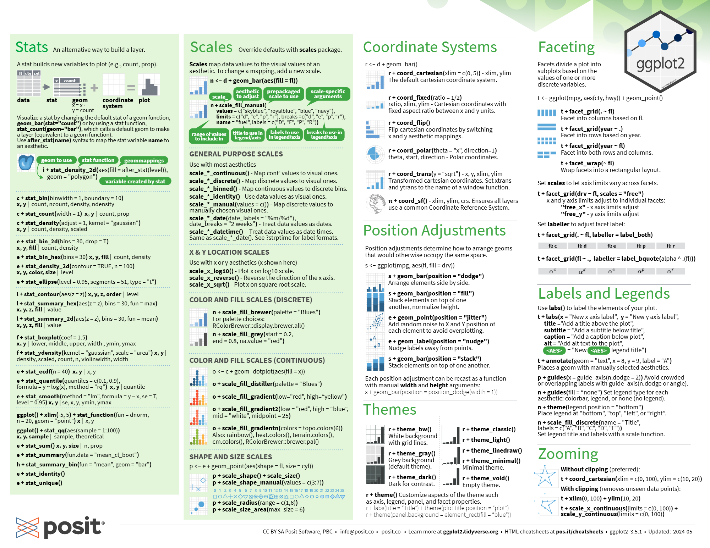
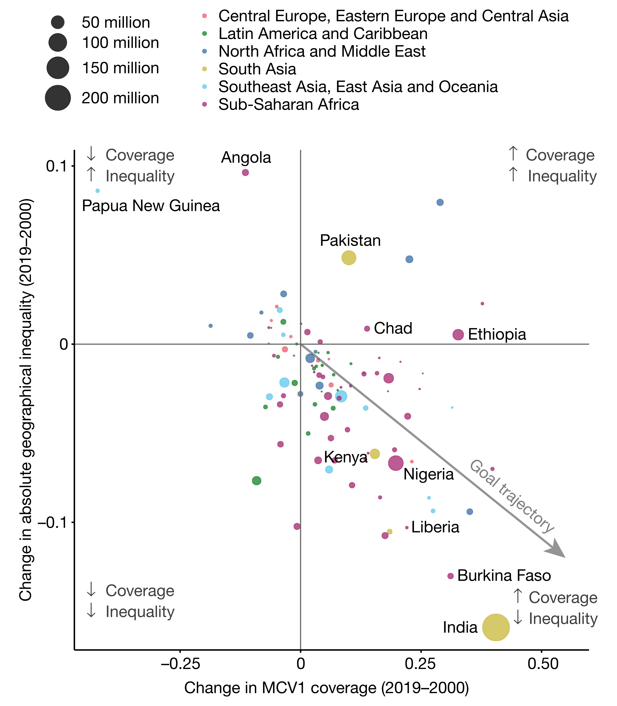

::: center-text
[🚀 Presentation](slide_r04.html){.btn .btn-outline-secondary style="border-radius: 12px;"}
:::

## Data visualization

-   Now that we have the results of our study, we should visualise it to disseminate the information.

-   In base R, we use `plot()` (and other functions) to draw figures.

-   In `tidyverse`, we use the `ggplot2` package

## Example

::::: columns
::: {.column width="50%"}
**Base R**:

```{r}
plot(
  x = mtcars$wt,
  y = mtcars$mpg,
  xlab = "Weight (1000 lbs)",
  ylab = "Miles Per Gallon",
  main = "MPG vs. Weight",
  pch = 19,       # Solid circle points
  col = "blue"
)
```
:::

::: {.column width="50%"}
**ggplot2**:

```{r}
library(ggplot2)
ggplot(mtcars, aes(x = wt, y = mpg)) +
  geom_point(color = "blue") +
  scale_x_continuous("Weight (1000 lbs)") +
  scale_y_continuous("Miles Per Gallon") +
  ggtitle("MPG vs. Weight") + 
  theme_bw()
```
:::
:::::

## ggplot2 structure

-   `ggplot2` works directly with tidy data (same as everything under tidyverse).

-   It is based on a concept called “grammar of graphics”.

-   Has intuitive and comprehensive documentation on how to use it effectively.

-   Provide **enough** flexibility for customisation.

## Grammar of graphics

-   A framework to describe and construct graphics in a structured manner.

-   Has a layered approach, i.e. each component of a figure is a separate layer.

## Grammar of graphics


## Grammar of graphics

-   Look back at the example code:

```{r}
#| results: hide
ggplot(mtcars, aes(x = wt, y = mpg)) +
  geom_point(color = "blue") +
  scale_x_continuous("Weight (1000 lbs)") +
  scale_y_continuous("Miles Per Gallon") +
  ggtitle("MPG vs. Weight") + 
  theme_bw()
```

-   Can you identify the different layers of this plot?

## Grammar of graphics

`ggplot(mtcars, aes(x = wt, y = mpg))` - Data: `mtcars`. - Aesthetics: `aes(x = wt, y = mpg)` - Geometries: `geom_point` - Coordinates: `scale_x_continuous`, `scale_y_continuous`, `ggtitle` - Theme: `theme_bw`

::: callout-tip
`ggplot2` must run with data which is **data frame**, and we couldn't run with another type of data (eg: matrix or vector).
:::

## Geometries

-   `geom_col` or `geom_bar`: bar charts
-   `geom_histogram`: histogram charts
-   `geom_point`: scatter plots
-   `geom_line` or `geom_smooth`: line charts
-   `geom_boxplot`: box plots
-   Bla bla bla

::: callout-tip
**Data, aesthetic, geometric** object were important components of plot, if this structure is not have enough so plot wasn't actived.
:::

## Shape of `geom_point`


## Grammar of graphics





## Practice

-   Can we make the plot like that? 

## Practice

```{r}
country <- c("Angola", "Papua New Guinea", "Pakistan", "Chad", "Ethiopia", "Kenya", "Nigeria", "Liberia", "Burkina Faso", "India")
coverage <- c(-0.14, -0.35, 0.12, 0.14, 0.32, 0.07, 0.2, 0.18, 0.3, 0.35)
inequality <- c(0.1, 0.08, 0.05, 0.01, 0.005, -0.06, -0.07, -0.11, -0.13, -0.16)
df_plot <- data.frame(country, coverage, inequality)
df_plot
```

## Practice

-   Let remember, what is important components of plot?
-   Firstly, we determine the axis of plot. ::::fragment

```{r}
ggplot(df_plot, aes(x = coverage, y = inequality))
```

:::: \## Practice

-   Then, what we should to use type of geometry? ::::fragment

```{r}
ggplot(df_plot, aes(x = coverage, y = inequality)) +
  geom_point()
```

::::

## Practice

-   After that, we must to display the name of country. ::::fragment

```{r}
ggplot(df_plot, aes(x = coverage, y = inequality)) +
  geom_point() +
  geom_text(aes(label = country))
```

::::

## Practice

```{r}
ggplot(df_plot, aes(x = coverage, y = inequality)) +
  geom_point() +
  geom_text(aes(label = country), hjust = -0.2, vjust = 0.2)
```

## Practice

```{r}
ggplot(df_plot, aes(x = coverage, y = inequality)) +
  geom_point() +
  geom_text(aes(label = country), hjust = -0.2, vjust = 0.2) +
  xlim(c(-0.35, 0.55)) +
  ylim(c(-0.17, 0.1))
```

## Practice

-   The size of each point was different, so we must to create 2 variables: **size**, and **color**. ::::fragment

```{r}
df_plot$size <- c(1.1, 0.6, 3, 1, 2, 1.1, 3, 0.7, 1.1, 8)
df_plot$color <- c("purple", "blue", "yellow", "purple", "purple", "purple", "purple", "purple", "purple", "yellow")
df_plot
```

::::

## Practice

```{r}
ggplot(df_plot, aes(x = coverage, y = inequality)) +
  geom_point(aes(size = size, color = color)) +
  geom_text(aes(label = country), hjust = -0.2, vjust = 0.2) +
  xlim(c(-0.35, 0.55)) +
  ylim(c(-0.17, 0.1))
```

## Practice

```{r}
set.seed(123)
np <- 50
rd <- data.frame(
  country = rep("", np),
  coverage = rnorm(n = np, mean = 0.1, sd = 0.12),
  inequality = rnorm(n = np, mean = -0.05, sd = 0.04),
  size = rnorm(n = np, mean = 1, sd = 0.4),
  color = sample(
    c("red", "green", "darkblue", "yellow", "blue", "purple"),
    np,
    replace = T
  )
)
head(rd)
```

-   `set.seed(123)`: dùng để cố định cách tạo ra các điểm ngẫu nhiên.
-   `np <- 50`: tạo ra 50 điểm ngẫu nhiên.
-   `country = rep("", np)`: các điểm này không có tên quốc gia.
-   `coverage = rnorm(n = np, mean = 0.1, sd = 0.12)`: số thực được tạo ra ngẫu nhiên theo phân phối bình thường với trung bình là 0.1 và độ lệch chuẩn là 0.12.
-   `inequality = rnorm(n = np, mean = -0.05, sd = 0.04)`: số thực được tạo ra ngẫu nhiên theo phân phối bình thường với trung bình là -0.05 và độ lệch chuẩn là 0.04.
-   `size = rnorm(n = np, mean = 1, sd = 0.4)`: số thực được tạo ra ngẫu nhiên theo phân phối bình thường với trung bình là 1 và độ lệch chuẩn là 0.4.
-   `color = sample(1:6, np, replace = T)`: màu sắc là số nguyên ngẫu nhiên từ 1 đến 6.

## Practice

-   We must to merge two data.

::: fragment
```{r}
df_plot <- rbind(df_plot, rd)
ggplot(df_plot, aes(x = coverage, y = inequality)) +
  geom_point(aes(size = size, color = color)) +
  geom_text(aes(label = country), hjust = -0.2, vjust = 0.2) +
  xlim(c(-0.35, 0.55)) +
  ylim(c(-0.17, 0.1))
```
:::

## Practice

```{r}
cols <- c(
  "red" = "#fa8495",
  "green" = "#4ca258",
  "darkblue" = "#6493bb",
  "yellow" = "#d7c968",
  "blue" = "#7dd8f3",
  "purple" = "#bc5c91"
)

ggplot(df_plot, aes(x = coverage, y = inequality)) +
  geom_point(aes(size = size, color = color), alpha = 0.8) +
  geom_text(aes(label = country), hjust = -0.2, vjust = 0.2) +
  geom_vline(xintercept = 0, color = "#999999") +
  geom_hline(yintercept = 0, color = "#999999") +
  scale_x_continuous(breaks = c(-0.25, 0, 0.25, 0.5),
                     limits = c(-0.4, 0.55)) +
  scale_y_continuous(breaks = c(-0.1, 0, 0.1), limits = c(-0.16, 0.1)) +
  scale_size_continuous(
    breaks = c(2, 4, 6, 8),
    labels = c("50 million", "100 million", "150 million", "200 million"),
    range = c(0, 8),
    guide = guide_legend(order = 1)
  ) +
  scale_color_manual(
    values = cols,
    breaks = c("red", "green", "darkblue", "yellow", "blue", "purple"),
    labels = c(
      "Central Europe, Eastern Europe and Central Asia",
      "Latin America and Caribbean",
      "North Africa and Middle East",
      "South Asia",
      "Southeast Asia, East Asia and Oceania",
      "Sub-Saharan Africa"
    ),
    guide = guide_legend(order = 2)
  ) +
  labs(x = "Change in MCV1 coverage (2019-2000)",
       y = "Change in absolute geographical inequality (2019-2000)",
       size = NULL,
       color = NULL) +
  theme_classic() +
  theme(
    legend.position = "top",
    legend.direction = "vertical",
    legend.text = element_text(size = 11),
    legend.key.height = unit(0.5, "cm"),
    axis.text = element_text(size = 11)
  )
```

## Mapping

-   Before you want to create a map, you must to have a shapefile (format as `.shp`).

-   In `ggplot2`, you can use function `geom_map` to create a map.

-   You can see more information in Cheatsheet.

## The end

::: callout-tip
If we use \``ggplot2`, we need to use `tidyverse`.
:::
