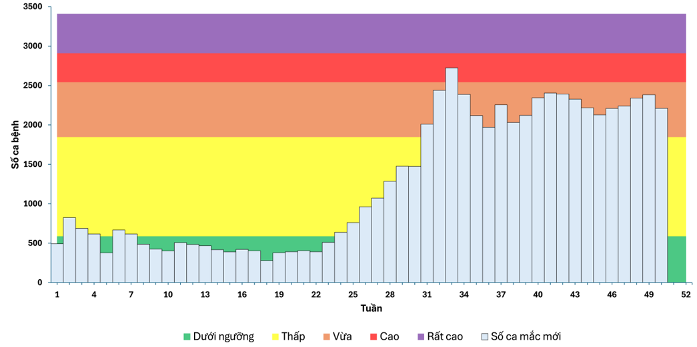
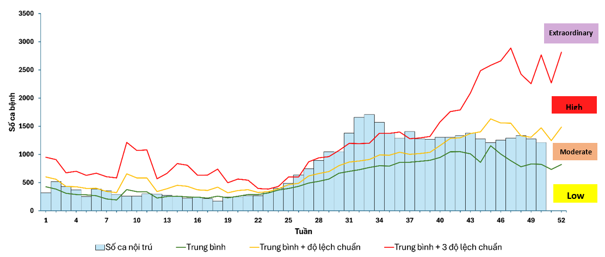
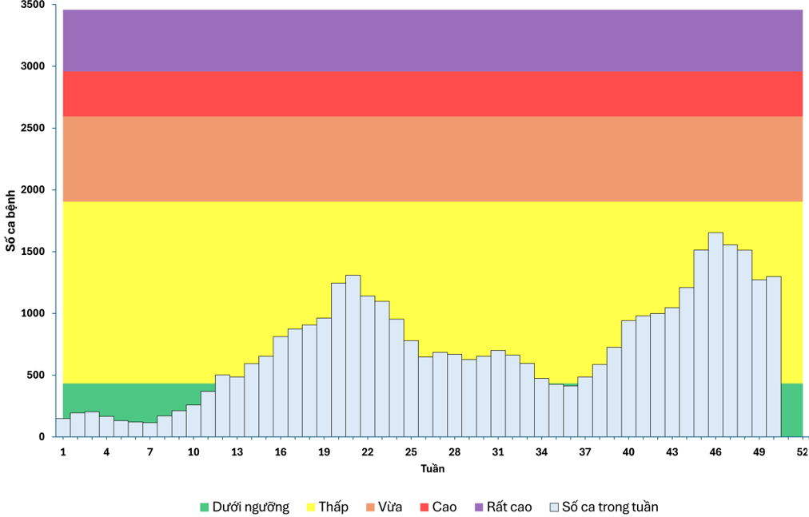
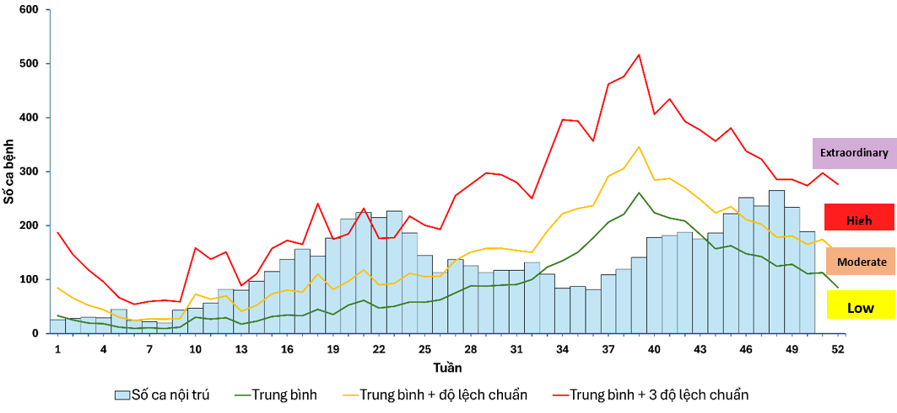

```{r}
source("functions.R")
```

```{r}
sxh <- load_data("https://docs.google.com/spreadsheets/d/1tkoFRYLPNrojiAFzdbpT2aZGkIjuaIn7EcDSRJcPPHY",
                sheet = "SXH_3KV")

out_f_sxh <- run_algo(sxh, 
                  ref_years = c(2016, 2017, 2018, 2020, 2023, 2025), 
                  method = "farrington")

out_c_sxh <- run_algo(sxh, 
                  ref_years = c(2016, 2017, 2018, 2020, 2023, 2025), 
                  method = "cusum")

## So sánh kết quả 
sxh_2025 <- out_f_sxh$df %>% filter(year==2025)
n <- 50
a_sxh <- sxh_2025[n,"cases"] %>% pull() #Current week
b_sxh <- sxh_2025[n-1,"cases"] %>% pull() #Pre-a week
c_sxh <- sxh_2025 %>% 
  filter(week>(n-5) & week<n) %>% 
  summarise(n = mean(cases)) %>% 
  pull() # Pre 4-weeks

# d_sxh <- sxh_2025 %>% filter(week<=n) %>% 
#   summarise(n = sum(cases)) %>% 
#   pull() ## Cummulative cases
d_sxh <- 64207

f_sxh <- out_f_sxh$result$upperbound[[n]] # Farrington of current week
g_sxh <- sxh_2025[n, "cdc"] %>% pull() # CDC of current week
h_sxh <- remake(sxh, c(2016, 2017, 2018, 2020, 2023))$seasonal
k_sxh <- out_c_sxh$result$upperbound[[n]] # CUSUM of current week

muc_do_lay_truyen_sxh <- "Trung bình"
muc_do_nang_sxh <- "Trung bình"
```

```{r}
tcm <- load_data("https://docs.google.com/spreadsheets/d/1ouVcS4B-sU07j4BT2VjHhxY13f2JUlqSeCY541vH6vA",
                sheet = "TCM_3KV")

out_f_tcm <- run_algo(tcm, 
                  ref_years = c(2017, 2019, 2020, 2022, 2024, 2025), 
                  method = "farrington")

out_c_tcm <- run_algo(tcm, 
                  ref_years = c(2017, 2019, 2020, 2022, 2024, 2025), 
                  method = "cusum")

## So sánh kết quả
tcm_2025 <- out_f_tcm$df %>% filter(year==2025)
n <- 50
a_tcm <- tcm_2025[n,"cases"] %>% pull() #Current week
b_tcm <- tcm_2025[n-1,"cases"] %>% pull() #Pre-a week
c_tcm <- tcm_2025 %>% 
  filter(week>(n-5) & week<n) %>% 
  summarise(n = mean(cases)) %>% 
  pull() # Pre 4-weeks

# d_tcm <- tcm_2025 %>% filter(week<=n) %>% 
#   summarise(n = sum(cases)) %>% 
#   pull() ## Cummulative cases
d_tcm <- 36786

f_tcm <- out_f_tcm$result$upperbound[[n]] # Farrington of current week
g_tcm <- tcm_2025[n, "cdc"] %>% pull() # CDC of current week
h_tcm <- remake(tcm, c(2016, 2017, 2018, 2020, 2023))$seasonal
k_tcm <- out_c_tcm$result$upperbound[[n]] # CUSUM of current week

muc_do_lay_truyen_tcm <- "Thấp"
muc_do_nang_tcm <- "Cao"
```

## Tóm tắt tình hình dịch tuần 50/2025

```{r}
df_combined <- tibble(
  ChiTieu = c(
    "<b>Số ca cộng dồn (từ đầu năm)</b>",
    "<b>Số ca trong tuần</b>",
    "&nbsp;&nbsp;- So với tuần trước",
    "&nbsp;&nbsp;- So với TB 4 tuần trước",
    "<b>So với ngưỡng cảnh báo:</b>",
    "&nbsp;&nbsp;- So với ngưỡng mùa",
    "&nbsp;&nbsp;- So với ngưỡng CUSUM",
    "&nbsp;&nbsp;- So với ngưỡng Farrington",
    "&nbsp;&nbsp;- So với ngưỡng CDC (Mean+2SD)",
    "<b>Đánh giá nguy cơ:</b>",
    "&nbsp;&nbsp;- Mức độ lây truyền",
    "&nbsp;&nbsp;- Mức độ nặng"
  ),
  SXH = c(
    format(d_sxh, big.mark = "."), 
    format(a_sxh, big.mark = "."), 
    format_metric(a_sxh, b_sxh),
    format_metric(a_sxh, c_sxh),
    "", 
    format_metric(a_sxh, h_sxh),
    format_metric(a_sxh, k_sxh), 
    format_metric(a_sxh, f_sxh),
    format_metric(a_sxh, g_sxh),
    "", 
    format_badge(muc_do_lay_truyen_sxh),
    format_badge(muc_do_nang_sxh)
  ),
  TCM = c(
    format(d_tcm, big.mark = "."), 
    format(a_tcm, big.mark = "."), 
    format_metric(a_tcm, b_tcm),
    format_metric(a_tcm, c_tcm),
    "", 
    format_metric(a_tcm, h_tcm),
    format_metric(a_tcm, k_tcm), 
    format_metric(a_tcm, f_tcm),
    format_metric(a_tcm, g_tcm),
    "", 
    format_badge(muc_do_lay_truyen_tcm),
    format_badge(muc_do_nang_tcm)
  )
)

datatable(df_combined,
          rownames = FALSE,
          # Đổi tên cột hiển thị ở đây
          colnames = c("", "Sốt xuất huyết", "Tay chân miệng"),
          escape = FALSE, 
          options = list(
            dom = 't',
            paging = FALSE,
            ordering = FALSE,
            columnDefs = list(
              list(className = 'dt-center', targets = c(1, 2)), 
              list(width = '40%', targets = 0)            
            ),
            initComplete = JS(
              "function(settings, json) {",
              "$(this.api().table().header()).css({'background-color': '#f8f9fa', 'color': '#2c3e50', 'font-size': '20px'});",
              "}"
            )
          )
) %>%
  formatStyle(
    columns = 0:2,
    borderBottom = '1px solid #eee',
    fontSize = '18px',
    padding = '6px'
  )
```

## 1. Tình hình bệnh sốt xuất huyết

### 1.1. Giám sát và cảnh báo

```{r}
#| fig-cap: "Hình 1. Diễn tiến sốt xuất huyết toàn Thành phố đến tuần 50/2025"
#| fig-cap-location: bottom

sxh_3kv <- plot_algo_dual(out_f_sxh$df, out_f_sxh$result, out_c_sxh$result, 
                           year_target = 2025, week_target = 52, 
                           seasonal = remake(sxh, c(2016, 2017, 2018, 2020, 2023))$seasonal,
                           ref_years = c(2016, 2017, 2018, 2020, 2023))

sxh_3kv
```

-   Trong tuần 50, toàn Thành phố ghi nhận 2.211 ca mắc mới bệnh sốt xuất huyết, số ca mắc mới **giảm** 7,1% so với tuần trước và **giảm** 6,4% so với trung bình 4 tuần trước.

-   Số ca mắc mới tuần 50 **vượt ngưỡng** Farrington 10,7%, ghi nhận tuần thứ 4 liên tiếp vượt ngưỡng này. Tuy nhiên, so với ngưỡng Mean+2SD, số ca mắc hiện vẫn **thấp** hơn 19,4%.

```{r}
px <- readRDS("data/px_sxh.rds")

px <- px %>% 
  mutate(
    dif_farrington = round(((SoCa - Nguong_Farrington)*100/Nguong_Farrington), 1),
    dif_cusum = round(((SoCa - Nguong_CUSUM)*100/Nguong_CUSUM), 1)
  )

px %>% 
  select(Phuong, TichLuy, SoCa, SoCa_100k,
         SoSanh_TuanTruoc, SoSanh_TB4Tuan,
         dif_farrington, dif_cusum) %>% 
  datatable(
    colnames = c(
      "Phường/Xã" = "Phuong",
      "Tích lũy" = "TichLuy",
      "Số ca trên 100k dân" = "SoCa_100k",
      "Số ca tuần hiện tại" = "SoCa",
      "So sánh với tuần trước" = "SoSanh_TuanTruoc",
      "So sánh TB 4 tuần trước" = "SoSanh_TB4Tuan",
      "So với ngưỡng Farrington" = "dif_farrington",
      "So với ngưỡng CUSUM" = "dif_cusum"
    ),
    rownames = FALSE,
    options = list(
      columnDefs = list(
        list(
          targets = c(4, 5, 6, 7), 
          render = JS(
            "function(data, type, row, meta) {",
            "  // Chỉ thay đổi khi hiển thị (display)",
            "  if (type === 'display') {",
            "    var num = parseFloat(data);",
            "    var color = data < 0 ? 'green' : 'red';",
            "    var arrow = data < 0 ? '&darr;' : '&uarr;';",
            "    // toFixed(2) để luôn hiện 2 số lẻ, thêm dấu % ở cuối",
            "    return '<span style=\"color:' + color + '\">' + arrow + ' ' + num.toFixed(2) + '%' + '</span>';",
            "  }",
            "  return data;",
            "}"
          )
        )
      )
    )
  )
```

Trong tuần 50, giám sát ở cấp phường, xã ghi nhận 52 phường/xã vượt ngưỡng cảnh báo Farrington và CUSUM, trong đó 03 phường/xã vượt ngưỡng có số ca/100.000 dân cao nhất là **phường Tây Thạnh, phường Tây Nam, xã An Nhơn Tây**.

### 1.2. Đánh giá mức độ lây truyền



### 1.3. Đánh giá mức độ nặng



## 2. Tình hình bệnh tay chân miệng

### 2.1. Giám sát và cảnh báo

```{r}
#| fig-cap: "Hình 4. Diễn tiến tay chân miệng toàn Thành phố đến tuần 50/2025"
#| fig-cap-location: bottom

tcm_3kv <- plot_algo_dual(out_f_tcm$df, out_f_tcm$result, out_c_tcm$result, 
                         year_target = 2025, week_target = 52,
                         seasonal = remake(tcm, c(2017, 2019, 2020, 2022, 2024))$seasonal,
                         ref_years = c(2017, 2019, 2020, 2022, 2024))

tcm_3kv
```

-   Trong tuần 50, toàn Thành phố ghi nhận có 1.298 ca mắc mới, **tăng** 2,0% so với tuần 49 và **giảm** 6,8% so với trung bình 4 tuần trước. 

-   Số ca mắc tuần 50 tiếp tục **vượt ngưỡng** Farrington duy trì 8 tuần liên tục từ tuần 43 đến tuần 50. Đồng thời, ghi nhận số ca **gần chạm ngưỡng** Mean+2SD (thấp hơn khoảng 2,0%).

```{r}
px <- readRDS("data/px_tcm.rds")

px <- px %>% 
  mutate(
    dif_farrington = round(((SoCa - Nguong_Farrington)*100/Nguong_Farrington), 1),
    dif_cusum = round(((SoCa - Nguong_CUSUM)*100/Nguong_CUSUM), 1)
  )

px %>% 
  select(Phuong, TichLuy, SoCa, SoCa_100k,
         SoSanh_TuanTruoc, SoSanh_TB4Tuan,
         dif_farrington, dif_cusum) %>% 
  datatable(
    colnames = c(
      "Phường/Xã" = "Phuong",
      "Tích lũy" = "TichLuy",
      "Số ca trên 100k dân" = "SoCa_100k",
      "Số ca tuần hiện tại" = "SoCa",
      "So sánh với tuần trước" = "SoSanh_TuanTruoc",
      "So sánh TB 4 tuần trước" = "SoSanh_TB4Tuan",
      "So với ngưỡng Farrington" = "dif_farrington",
      "So với ngưỡng CUSUM" = "dif_cusum"
    ),
    rownames = FALSE,
    options = list(
      columnDefs = list(
        list(
          targets = c(4, 5, 6, 7), 
          render = JS(
            "function(data, type, row, meta) {",
            "  // Chỉ thay đổi khi hiển thị (display)",
            "  if (type === 'display') {",
            "    var num = parseFloat(data);",
            "    var color = data < 0 ? 'green' : 'red';",
            "    var arrow = data < 0 ? '&darr;' : '&uarr;';",
            "    // toFixed(2) để luôn hiện 2 số lẻ, thêm dấu % ở cuối",
            "    return '<span style=\"color:' + color + '\">' + arrow + ' ' + num.toFixed(2) + '%' + '</span>';",
            "  }",
            "  return data;",
            "}"
          )
        )
      )
    )
  )
```

Trong tuần 50, giám sát ở cấp phường, xã ghi nhận 50 phường/xã vượt ngưỡng cảnh báo Farrington và CUSUM, trong đó 03 phường/xã vượt ngưỡng có số ca/100.000 dân cao nhất là **xã Đất Đỏ, xã An Nhơn Tây, xã Hồ Tràm**.

### 2.2. Đánh giá mức độ lây truyền



### 2.3. Đánh giá mức độ nặng

