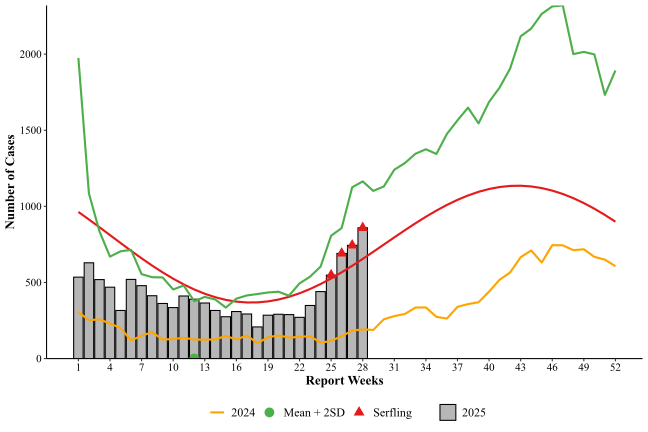
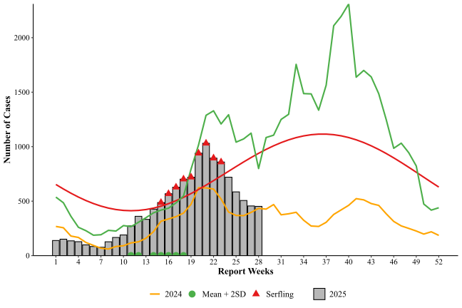

::: {.content-visible when="format=pdf or format=docx"}

\begin{minipage}[t]{0.48\textwidth}
\begin{center}
\textbf{TRUNG TÂM KIỂM SOÁT}\\
\textbf{BỆNH TẬT THÀNH PHỐ}\\
\underline{\textbf{KHOA GIÁM SÁT CẢNH BÁO,}}\\
\underline{\textbf{CHUẨN BỊ VÀ ĐÁP ỨNG KHẨN CẤP DỊCH BỆNH}}
\end{center}
\end{minipage}
\hfill
\begin{minipage}[t]{0.48\textwidth}
\begin{center}
\textbf{CỘNG HÒA XÃ HỘI CHỦ NGHĨA VIỆT NAM}\\
\textit{\textbf{Độc lập - Tự do - Hạnh phúc}}\\
\rule{5cm}{0.4pt}\\
TP. Hồ Chí Minh, ngày 25 tháng 7 năm 2025
\end{center}
\end{minipage}

:::

::: {.content-visible when="format=html"}

  
<a class="btn btn-primary" download href="report_282025.docx">📥 Tải bản PDF của báo cáo này</a>

:::

# I. Tình hình dịch bệnh sốt xuất huyết đến tuần 28:

## 1. Đối với hoạt động giám sát dựa vào chỉ số (IBS):

Trong tuần 28/2025, trên toàn Thành phố ghi nhận được 859 ca mắc mới, tăng khoảng 15,4% so với tuần trước và tăng khoảng 41,8% so với trung bình 4 tuần trước. Tính từ đầu năm, số ca tích lũy đến tuần 28 ghi nhận được 11.911 ca, tăng khoảng 167,9% so với cùng kì năm trước.

Diễn tiến số ca mắc sốt xuất huyết từ đầu năm đến nay nằm dưới ngưỡng (Trung bình + 2 lần Độ lệch chuẩn). Tuy nhiên, theo phương pháp cảnh báo Serfling, số ca vượt ngưỡng từ tuần 25 và xu hướng cảnh báo liên tục đến tuần hiện tại.

## 2. Đối với hoạt động giám sát dựa vào sự kiện (EBS):

### a. Kết quả giám sát xu hướng tìm kiếm thông tin dịch bệnh truyền nhiễm qua nền tảng Google Trends (Công cụ giám sát Google Trends):

\- Mức độ quan tâm:

\- Từ khóa hàng đầu (top queries):

\- Từ khóa gia tăng (top rising):

### b. Kết quả giám sát các trang tin điện tử, báo chí liên quan đến dịch BTN, sự kiện y tế công cộng (công cụ Media scanning):

| Ngày thu thập | TP.HCM | Tỉnh khác | Nước ngoài | Thuộc CIR |
|---------------|--------|-----------|------------|-----------|
| 07/7/2025     | 0      | 0         | 2          | 0         |
| 08/7/2025     | 0      | 0         | 0          | 0         |
| 09/7/2025     | 0      | 0         | 0          | 0         |
| 10/7/2025     | 0      | 0         | 0          | 0         |
| 11/7/2025     | 0      | 0         | 0          | 0         |
| Tổng          | 0      | 0         | 0          | 0         |
| Thuộc CIR     | 0      | 1         | 0          | 0         |

: \*Ghi chú: CIR-Critical Information Reporting – Sự kiện quan trọng, khẩn cấp cần phải báo cáo ngay

# II. Tình hình dịch bệnh tay chân miệng đến tuần 28:

## 1. Đối với hoạt động giám sát dựa vào chỉ số (IBS):

Trong tuần 28/2025, trên toàn Thành phố ghi nhận được 452 ca mắc mới, giảm khoảng 0,8% so với tuần trước và tăng khoảng 20,2% so với trung bình 4 tuần trước. Tính từ đầu năm, số ca tích lũy đến tuần 28 ghi nhận được 12.241 ca, tăng khoảng 48,7% so với cùng kì năm trước.

Đối với cảnh báo sớm, số ca bệnh đã vượt ngưỡng trung bình cộng 2 lần độ lệch chuẩn từ tuần 14 đế tuần 18. Tuy nhiên, phương pháp Serfling cảnh báo số ca tăng bất thường từ tuần 15 và cảnh báo liên tục đến tuần 23. Số ca bệnh trong tuần 28 đã giảm dưới ngưỡng của 2 phương pháp cảnh báo dịch.

## 2. Đối với hoạt động giám sát dựa vào sự kiện (EBS):

### a. Kết quả giám sát xu hướng tìm kiếm thông tin dịch bệnh truyền nhiễm qua nền tảng Google Trends (Công cụ giám sát Google Trends):

\- Mức độ quan tâm:

\- Từ khóa hàng đầu (top queries):

\- Từ khóa gia tăng (top rising):

### b. Kết quả giám sát các trang tin điện tử, báo chí liên quan đến dịch BTN, sự kiện y tế công cộng (công cụ Media scanning):

| Ngày thu thập | TP.HCM | Tỉnh khác | Nước ngoài | Thuộc CIR |
|---------------|--------|-----------|------------|-----------|
| 07/7/2025     | 0      | 0         | 2          | 0         |
| 08/7/2025     | 0      | 0         | 0          | 0         |
| 09/7/2025     | 0      | 0         | 0          | 0         |
| 10/7/2025     | 0      | 0         | 0          | 0         |
| 11/7/2025     | 0      | 0         | 0          | 0         |
| Tổng          | 0      | 0         | 0          | 0         |
| Thuộc CIR     | 0      | 1         | 0          | 0         |

: \*Ghi chú: CIR-Critical Information Reporting – Sự kiện quan trọng, khẩn cấp cần phải báo cáo ngay

# Nhận định

# Đề xuất
