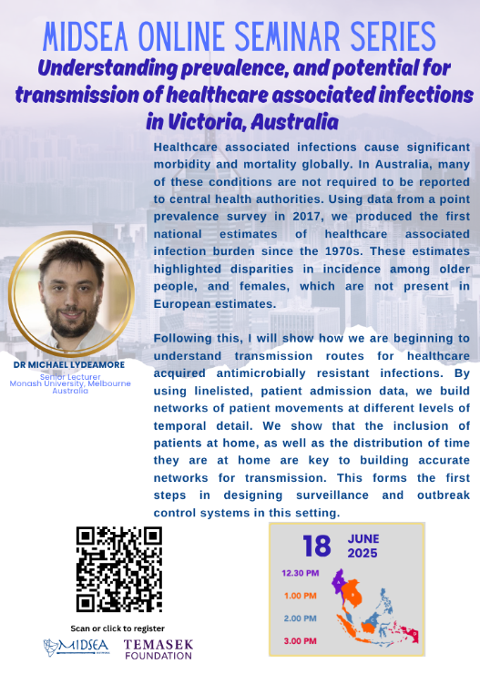

## Epidemiology

1.  Joint UNIversities Pandemic and Epidemiological Research (JUNIPER) seminar [Link](https://maths.org/juniper/seminars)

2.  LSHTM Centre for Epidemic Preparedness and Response seminar series [Link](https://www.lshtm.ac.uk/newsevents/events/series/centre-epidemic-preparedness-and-response)

3.  Havard T.H. Chan School of Public Health: Seminars in Epidemiology [Link](https://hsph.harvard.edu/department/epidemiology/seminar-series/)

4.  Havard T.H. Chan School of Public Health: Center for Communicable Disease Dynamics, ID Epi Spring Seminar Series [Link](https://hsph.harvard.edu/research/communicable-disease-ccdd/id-epi-spring-seminar-series-2025/)

## Modeling

1.  Advances in Socio-Epidemic Mathematical Modelling UMI-MSE online seminar [Link](https://mseumi.wordpress.com/online-seminars/)

2.  LSHTM Centre for data and statistical science for health seminar series [Link](https://www.lshtm.ac.uk/newsevents/events/series/centre-data-and-statistical-science-health)

3.  LSHTM Centre for Mathematical Modelling of Infectious Diseases seminar series [Link](https://www.lshtm.ac.uk/newsevents/events/series/centre-mathematical-modelling-infectious-diseases)

4.  The MIDSEA Network [Link](https://midsea.network/event/)

## The Public Health Emergency Operations Centre

This session introduces key online learning resources on Public Health Emergency Operations Centres (PHEOC) and Public Health Emergency Management (PHEM). Participants will be guided to relevant self-paced courses provided by trusted institutions such as WHO, CDC, and other global partners. These resources support capacity building for emergency preparedness and response.

1.  Ready4Response Tier 2: Systems, structures and skills [Link](https://drive.google.com/drive/u/2/folders/1aLq6bfMAk0dv1HtO_lg4WAqQFLWs64K8)

2.  The Public Health Emergency Operations Centre (PHEOC) [Link](https://drive.google.com/drive/u/2/folders/1Qzv4Yt9El_9C88xDRLWtgPfWs1R1s211)

3.  King County Emergency Management [Link](https://kingcounty.gov/en/dept/executive-services/governance-leadership/)

4.  Rapid Response Teams Training Programme - WHO [Link](https://extranet.who.int/hslp/package/rapid-response-teams-training-programme)

## Field Epidemiology Training Program

1.  Abstract Writing (18/6/2025) [Link](https://taskforce-org.zoom.us/webinar/register/WN_kh2hzd9TS8uANXWJRP4C-A)

2.  Qualitative Data Collection During an Outbreak Part I (16/7/2025) [Link](https://taskforce-org.zoom.us/webinar/register/WN_Ol6TwQChRpKGVSD2cdZWNQ)

3.  Qualitative Data Collection During an Outbreak Part II (20/8/2025) [Link](https://taskforce-org.zoom.us/webinar/register/WN_ODv4Hs_FQaaPrne5WdRHhw)

4.  Informatics & Data Viz Basics for Field Epidemiology (17/9/2025) [Link](https://taskforce-org.zoom.us/webinar/register/WN_gkqhsbY0RbuD9E1e2PmvKQ)

5.  Surveillance System Evaluations (15/10/2025) [Link](https://taskforce-org.zoom.us/webinar/register/WN_5N8iFGolS6CqwiD4FaK8FQ)

6.  Matching in Case: Control Studies: Should I Do It? When to Do It and Why (19/11/2025) [Link](https://taskforce-org.zoom.us/webinar/register/WN_q2m9v_csQNCGs7OEyRABAQ)

7.  Using an Outline When Writing: How to Clear Your Thoughts Before Putting Pen to Paper (21/1/2026) [Link](https://taskforce-org.zoom.us/webinar/register/WN_bm-M5DrhQO2y7wLuSHCN9g)

8.  Facilitating a Case Study (18/2/2026) [Link](https://taskforce-org.zoom.us/webinar/register/WN_8sIeK5IRTG2cU1_uyQjU0w)

# MIDSEA

::::: columns
::: {.column width="60%"}
**Date & Time**: June 18, 2025 (13:00 Vietnam)

**Location**: Room 3.03 (HCDC - District 8)

**Via**: Zoom

**Speakers**: Dr. Michael Lydeamore *(Monash University, Melbourne, Australia)*

**Topic**: Understanding prevalence, and potential for tranmission of healthcare associated infections in Victoria, Australia
:::

::: {.column width="40%"}

:::
:::::