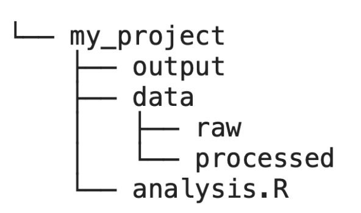
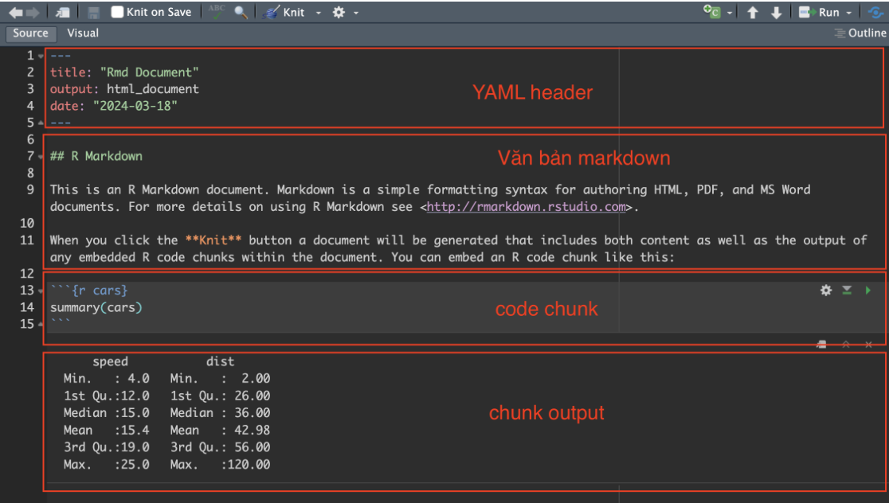

::: center-text
[📎 simulated_covid](../data/simulated_covid.rds){.btn .btn-outline-secondary style="border-radius: 12px;"} [📎 cleaned_vacdata](../data/cleaned_vacdata.rds){.btn .btn-outline-secondary style="border-radius: 12px;"}
:::

## R project

### Tạo Project trong R Studio

R project là một thư mục với file `.Rproj` . Để thuận tiện cho việc quản lý code và dữ liệu, ta nên tạo R project cho mỗi nghiên cứu/ báo cáo.

Quá trình tạo R project như sau:

-   Vào menu **`File` \> `New Project`**

-   Bấm **`New Directory` \>** **`New Project`**

-   Điền tên folder cho R Project tại mục **`Directory name`**

-   Bấm **`Browse`** và chọn Desktop để lưu R project tại Desktop

-   Bấm **`Create Project`**

### Cấu trúc của một Project

Cấu trúc của một R project sẽ có định dạng như sau:

{width="218"}

-   `data` thư mục chứa dữ liệu cần phân tích

-   `output` lưu trữ đầu ra mã (cốt truyện, số liệu, v.v.)

-   `analysis.R` là tệp chứa mã R. Có thể có nhiều file `.R` trong 1 project.

### R markdown

File `.Rmd` thường được dùng cho báo cáo vì có thể kết hợp các lệnh R, văn bản thường, đồ thị trong 1 file 

Gồm 3 phần chính:

-   Phần YAML header: nằm ở trên cùng trong và ngăn cách với phần còn lại bằng cặp dấu `---`. Phần này để mô tả tiêu đề tài liệu, tác giả, ngày tháng, định dạng mong muốn

-   Phần văn bản (được viết bằng ngôn ngữ **markdown**)

-   Phần lệnh R (được gọi là **chunk**). Phần kết quả của câu lệnh R (chunk output) có thể hiển thị dưới dạng string, bảng dữ liệu hoặc đồ thị.



Tạo R Markdown bằng cách vào menu `File` \> `New File` \> `R Markdown...`

## Bảng phân tích thống kê

-   Tải package:  `tidyverse`, `gtsummary`

-   Load package:

```{webr-r}

```

```{r, warning=F, message = F}
#| code-fold: true
#| code-summary: "Code"
library(tidyverse) 
library(gtsummary) 
```

Chúng ta sẽ sử dụng dữ liệu mô phỏng các ca bệnh Covid 19

```{webr-r}

```

```{r, message=FALSE, warning=FALSE}
#| code-fold: true
#| code-summary: "Code"
#linelist <- read_rds("https://raw.githubusercontent.com/HCDC-GSCB/swaper/main/data/simulated_covid.rds") %>% mutate_if(is.Date, ymd) 

linelist <- read_rds("../data/simulated_covid.rds") %>% mutate_if(is.Date, ymd)
```

Dữ liệu bao gồm 2 đợt bùng phát dịch.

### gtsummary

Package gtsummary được dùng vẽ bảng thống kê một cách nhanh chóng bằng lệnh tbl_summary()

**VD:** sử dụng tbl_summary() 

```{webr-r}

```

```{r, message=FALSE}
#| code-fold: true
#| code-summary: "Code"
#| results: hide
linelist[,-2] %>% tbl_summary()
```

```{r, echo=F, message=FALSE, results='asis'}
cat("<details><summary>Output</summary>\n")

linelist[,-2] %>%
  tbl_summary() %>%
  as_gt() %>%
  gt::as_raw_html() %>%
  cat()

cat("\n</details>")
```

### Điều chỉnh bảng thống kê

Một số tham số của `tbl_summary` hỗ trợ điều chỉnh bảng thống kê

| Tên tham số | Công dụng                                      |
|-------------|------------------------------------------------|
| `include`   | Chọn các biến được hiển thị trên bảng thống kê |
| `label`     | Đổi cách hiển thị tên biến                     |
| `by`        | Hiển thị thống kê nhóm theo giá trị của 1 biến |
| `statistic` | Điều chỉnh thống kê được hiển thị              |

**Chọn các biến được thống kê qua tham số `include`**

```{webr-r}

```

```{r, message=FALSE}
#| code-fold: true
#| code-summary: "Code"
linelist %>%
  tbl_summary(
    include = c(age, sex, outcome, date_onset, date_admission, date_first_contact, date_last_contact, outbreak)
  )
```

**Thay đổi tên biến qua tham số `label`**

**VD**: đổi tên được hiển thị cho các biến

```{webr-r}

```

```{r, message=FALSE}
#| code-fold: true
#| code-summary: "Code"
linelist %>% tbl_summary(
    include = c(age, sex, outcome, date_onset, date_admission,
                date_first_contact, date_last_contact, outbreak),
    # ----- Thay đổi cách hiển thị tên biến ------
    label = list(
      age ~ "Tuổi",
      sex ~ "Giới tính",
      outcome ~ "Kết quả",
      date_onset ~ "Ngày phát bệnh",
      date_admission ~ "Ngày nhập viện",
      date_first_contact ~ "Ngày tiếp xúc đầu tiên",
      date_last_contact ~ "Ngày tiếp xúc cuối cùng",
      outbreak ~ "Đợt dịch"
    )
  )
```

**Thống kê theo nhóm qua tham số `by`**

**VD:** hiện thống kê cho từng đợt dịch

```{webr-r}

```

```{r, message=FALSE}
#| code-fold: true
#| code-summary: "Code"
linelist %>% tbl_summary(
  include = c(age, sex, outcome, date_onset, date_admission,
                date_first_contact, date_last_contact, outbreak),
  label = list(
      age ~ "Tuổi",
      sex ~ "Giới tính",
      outcome ~ "Kết quả",
      date_onset ~ "Ngày phát bệnh",
      date_admission ~ "Ngày nhập viện",
      date_first_contact ~ "Ngày tiếp xúc đầu tiên",
      date_last_contact ~ "Ngày tiếp xúc cuối cùng"
    ),
  # ----- Hiển thị thống kê cho từng đợt dịch ------
  by = outbreak)
```

**Điều chỉnh thống kê được hiển thị qua tham số `statistic`**

Người dùng có thể lựa chọn các phép thống kê để áp dụng lên các biến

**VD:** format thống kê cho  `sex`  và `outcome`

```{webr-r}

```

```{r, message=FALSE}
#| code-fold: true
#| code-summary: "Code"
linelist %>% tbl_summary(
  include = c(age, sex, outcome, date_onset, date_admission,
                date_first_contact, date_last_contact, outbreak),
  label = list(
      age ~ "Tuổi",
      sex ~ "Giới tính",
      outcome ~ "Kết quả",
      date_onset ~ "Ngày phát bệnh",
      date_admission ~ "Ngày nhập viện",
      date_first_contact ~ "Ngày tiếp xúc đầu tiên",
      date_last_contact ~ "Ngày tiếp xúc cuối cùng"
    ),
  by = outbreak,
  # ----- điều chỉnh thống kê ------
  statistic = list(
    sex ~ "{n} / {N} ({p}%)",
    outcome ~ "{n} / {N} ({p}%)"
  ))
```

**Điều chỉnh số chữ số thập phân qua tham số `digits`**

**VD:** Hiển thị tuổi với 2 chữ số thập phân

```{webr-r}

```

```{r, message=FALSE}
#| code-fold: true
#| code-summary: "Code"
linelist %>% tbl_summary(
  include = c(age, sex, outcome, date_onset, date_admission,
                date_first_contact, date_last_contact, outbreak),
  label = list(
      age ~ "Tuổi",
      sex ~ "Giới tính",
      outcome ~ "Kết quả",
      date_onset ~ "Ngày phát bệnh",
      date_admission ~ "Ngày nhập viện",
      date_first_contact ~ "Ngày tiếp xúc đầu tiên",
      date_last_contact ~ "Ngày tiếp xúc cuối cùng"
    ),
  by = outbreak,
  statistic = list(
    sex ~ "{n} / {N} ({p}%)",
    outcome ~ "{n} / {N} ({p}%)",
    all_continuous() ~ "{mean} [{min}, {max}]"
  ), 
  # ----- hiển thị 2 chữ số thập phân cho tuổi ------
  digits = age ~ 2)
```

**Điều chỉnh giá trị được hiển thị**

Để thay đổi tên các nhóm của biến phân loại, ta có thể sử dụng lệnh `factor` trước khi tạo bảng

Để thay đổi cách hiển thị giá trị bị thiếu, ta có thể sử dụng tham số `missing_text`của `tbl_summary`

**VD:**

```{webr-r}

```

```{r, message=FALSE}
#| code-fold: true
#| code-summary: "Code"
linelist %>% 
  mutate(
    # ------ đổi tên các nhóm trong biến phân loại ----
    sex = factor(sex, levels = c("f", "m"), labels = c("nữ", "nam")),
    outcome = factor(outcome, 
                     levels = c("died", "recovered"), 
                     labels = c("tử vong", "khỏi bệnh")),
    outbreak = factor(outbreak, 
                      levels = c("1st outbreak", "2nd outbreak"), 
                      labels = c("Đợt dịch 1", "Đợt dịch 2"))
  ) %>% 
  tbl_summary(
    # ----- Đổi label cho các giá trị bị thiếu từ "Unknown" sang "NA" -----
    missing_text = "NA",    
    include = c(age, sex, outcome, date_onset, date_admission,
                  date_first_contact, date_last_contact, outbreak),
    label = list(
        age ~ "Tuổi",
        sex ~ "Giới tính",
        outcome ~ "Kết quả",
        date_onset ~ "Ngày phát bệnh",
        date_admission ~ "Ngày nhập viện",
        date_first_contact ~ "Ngày tiếp xúc đầu tiên",
        date_last_contact ~ "Ngày tiếp xúc cuối cùng"
      ),
    by = outbreak,
    statistic = list(
      sex ~ "{n} / {N} ({p}%)",
      outcome ~ "{n} / {N} ({p}%)",
      all_continuous() ~ "{mean} [{min}, {max}]"),
    digits = age ~ 2
  )
```

### Kết hợp nhiều bảng thống kê

Lệnh `tbl_stack` được sử dụng để kết hợp nhiều bảng thống kê có header giống nhau

**VD**: Làm bảng tỉ lệ tử vong theo quận trong đợt 1, đợt 2 và cả 2 đợt

```{webr-r}

```

```{r, message=FALSE}
#| code-fold: true
#| code-summary: "Code"
# ----- Bảng tỷ lệ tử vong trong cả 2 đợt dịch -----
both_outbreak <- linelist %>% 
  mutate(
    outcome = factor(outcome, 
                     levels = c("died", "recovered"), 
                     labels = c("tử vong", "khỏi bệnh"))
  ) %>% 
  tbl_summary(
    include = c(outcome, district),
    label = outcome ~ "Kết quả",
    by = district,
    statistic = outcome ~ "{n} / {N} ({p}%)"
  ) %>% 
  modify_header(all_stat_cols() ~ "**{level}**", label = "**Quận**") 

# ----- Bảng tỷ lệ tử vong trong đợt 1 -----
tbl_first_outbreak <- linelist %>%
  mutate(
    outcome = factor(outcome, 
                     levels = c("died", "recovered"), 
                     labels = c("tử vong", "khỏi bệnh"))
  ) %>% 
  filter(outbreak == "1st outbreak") %>%
  tbl_summary(
    include = c(outcome, district),
    label = outcome ~ "Kết quả",
    by = district,
    statistic = outcome ~ "{n} / {N} ({p}%)"
  ) %>% 
  modify_header(all_stat_cols() ~ "**{level}**", label = "**Quận**") 

# ----- Bảng tỷ lệ tử vong trong đợt 2 -----
tbl_second_outbreak <- linelist %>%
  mutate(
    outcome = factor(outcome, 
                     levels = c("died", "recovered"), 
                     labels = c("tử vong", "khỏi bệnh"))
  ) %>% 
  filter(outbreak == "2nd outbreak") %>%
  tbl_summary(
    include = c(outcome, district),
    label = outcome ~ "Kết quả",
    by = district,
    statistic = outcome ~ "{n} / {N} ({p}%)"
  ) %>% 
  modify_header(all_stat_cols() ~ "**{level}**", label = "**Quận**") 

tbl_stack(list(tbl_first_outbreak, tbl_second_outbreak, both_outbreak), group_header = c("Đợt 1", "Đợt 2", "Cả 2 đợt")) %>% 
  # --- optional: code điều chỉnh header cho từng bảng để dễ nhìn hơn ---- 
  as_gt() %>% 
  gt::tab_style(
    style = gt::cell_text(weight = "bold"),
    locations = gt::cells_row_groups(groups = everything())
  )
```

## Kiểm định thống kê

Để thêm kết quả cho phép kiểm định thống kê vào bảng phân tích, sử dụng lệnh `add_p` theo cú pháp `add_p(tên_biến ~ "phép kiểm định")`

Một số phép kiểm định thông dụng

-   `t.test` - Kiểm định t

-   `chisq.test` - Kiểm định Chi bình phương ( )

-   `fisher.test` - Kiểm tra Fisher exact

Tổng hợp các phép kiểm định thống kê

+------------------------------+---------------------------------------------------------------------------------------------+----------------------------------------------------+
| Phép kiểm                    | **Mô tả**                                                                                   | Kết quả                                            |
+==============================+=============================================================================================+====================================================+
| **Kiểm định T**              | So sánh giá trị trung bình của biến liên tục giữa hai nhóm.                                 |  không có sự khác biệt giữa trung bình của 2 nhóm  |
|                              |                                                                                             |                                                    |
|                              |                                                                                             | p-value \< 0.05: có sự khác biệt giữa 2 nhóm       |
|                              |                                                                                             |                                                    |
|                              |                                                                                             | p-value \> 0.05: không có sự khác biệt giữa 2 nhóm |
+------------------------------+---------------------------------------------------------------------------------------------+----------------------------------------------------+
| **Kiểm định Chi-Square**     | Kiểm tra biến phân loại giữa 2 nhóm có liên quan hay không                                  |  không có sự liên quan giữa 2 biến                 |
|                              |                                                                                             |                                                    |
|                              |                                                                                             | p-value \< 0.05: có sự liên quan giữa 2 nhóm       |
|                              |                                                                                             |                                                    |
|                              |                                                                                             | p-value \> 0.05: không có sự liên quan giữa 2 nhóm |
+------------------------------+---------------------------------------------------------------------------------------------+----------------------------------------------------+
| **Kiểm định Fisher’s Exact** | Tương tự như Chi-squared, kiểm tra mối liên hệ giữa hai biến phân loại nhưng cho cỡ mẫu nhỏ |                                                    |
+------------------------------+---------------------------------------------------------------------------------------------+----------------------------------------------------+

### Kiểm định T

**VD 1:** Kiểm tra độ tuổi trung bình giữa 2 đợt dịch

```{webr-r}

```

```{r, message=FALSE}
#| code-fold: true
#| code-summary: "Code"
linelist %>% 
  mutate(
    outbreak = factor(outbreak, 
                      levels = c("1st outbreak", "2nd outbreak"), 
                      labels = c("Đợt 1", "Đợt 2"))
  ) %>% 
  tbl_summary(
    include = c(age, outbreak),
    label = age ~ "Tuổi",
    by = outbreak
  ) %>% 
  modify_header(label = "**Đặc điểm**")  %>% 
  add_p(test = age ~ "t.test")
```

**VD 2:** Kiểm tra độ tuổi trung bình của 2 nhóm khỏi bệnh và tử vong

```{webr-r}

```

```{r, message=FALSE}
#| code-fold: true
#| code-summary: "Code"
# ----- Bảng kết quả cho đợt dịch đầu ---- 
first_outbreak <- linelist %>% 
  mutate(
    outcome = factor(outcome, 
                     levels = c("died", "recovered"), 
                     labels = c("tử vong", "khỏi bệnh"))
  ) %>% 
  filter(outbreak == "1st outbreak") %>% 
  tbl_summary(
    include = c(age, outcome),
    label = age ~ "Tuổi",
    by = outcome
  ) %>% 
  # điều chỉnh header để các bảng có chung header
  modify_header(all_stat_cols() ~ "**{level}**") %>% 
  add_p(test = age ~ "t.test")
```

```{webr-r}

```

```{r, message=FALSE}
#| code-fold: true
#| code-summary: "Code"
# ----- Bảng kết quả cho đợt dịch thứ hai ---- 
second_outbreak <- linelist %>% 
  filter(outbreak == "2nd outbreak") %>% 
  mutate(
    outcome = factor(outcome, 
                     levels = c("died", "recovered"), 
                     labels = c("tử vong", "khỏi bệnh"))
  ) %>% 
  tbl_summary(
    include = c(age, outcome),
    label = age ~ "Tuổi",
    by = outcome
  ) %>% 
  modify_header(all_stat_cols() ~ "**{level}**") %>% 
  add_p(test = age ~ "t.test")
```

```{webr-r}

```

```{r, message=FALSE}
#| code-fold: true
#| code-summary: "Code"
# ----- Bảng kết quả cho cả hai đợt dịch ---- 
both_outbreak <- linelist %>% 
  mutate(
    outcome = factor(outcome, 
                     levels = c("died", "recovered"), 
                     labels = c("tử vong", "khỏi bệnh"))
  ) %>% 
  tbl_summary(
    include = c(age, outcome),
    label = age ~ "Tuổi",
    by = outcome
  ) %>% 
  # điều chỉnh header để các bảng có chung header
  modify_header(all_stat_cols() ~ "**{level}**") %>% 
  add_p(test = age ~ "t.test")
```

```{webr-r}

```

```{r, message=FALSE}
#| code-fold: true
#| code-summary: "Code"
tbl_stack(list(first_outbreak, second_outbreak, both_outbreak), 
          group_header = c("Đợt 1", "Đợt 2", "Cả 2 đợt")) %>% 
  # --- optional: code điều chỉnh style header ---- 
  modify_header(label = "**Đặc điểm**")  %>% 
  as_gt() %>% 
  gt::tab_style(
    style = gt::cell_text(weight = "bold"),
    locations = gt::cells_row_groups(groups = everything())
  )
```

### Kiểm định Chi bình phương

**VD:** Kiểm tra giới tính có ảnh hưởng đến khả năng tử vong hay không

```{webr-r}

```

```{r, message=FALSE}
#| code-fold: true
#| code-summary: "Code"
# ----- Bảng kết quả cho đợt dịch đầu ---- 
tbl_first_outbreak <- linelist %>%
  mutate(
    sex = factor(sex, levels = c("f", "m"), labels = c("nữ", "nam")),
    outcome = factor(outcome, 
                     levels = c("died", "recovered"), 
                     labels = c("tử vong", "khỏi bệnh"))
  ) %>% 
  filter(outbreak == "1st outbreak") %>%
  tbl_summary(
    include = c(sex, outcome), 
    label = outcome ~ "Kết quả",
    by = sex) %>%
  # điều chỉnh header để các bảng có chung header
  modify_header(all_stat_cols() ~ "**{level}**") %>% 
  add_p(test = outcome ~ "chisq.test")
```

```{webr-r}

```

```{r, message=FALSE}
#| code-fold: true
#| code-summary: "Code"
# ----- Bảng kết quả cho đợt dịch thứ 2 ---- 
tbl_second_outbreak <- linelist %>%
  mutate(
    sex = factor(sex, levels = c("f", "m"), labels = c("nữ", "nam")),
    outcome = factor(outcome, 
                     levels = c("died", "recovered"), 
                     labels = c("tử vong", "khỏi bệnh"))
  ) %>% 
  filter(outbreak == "2nd outbreak") %>%
  tbl_summary(
    include= c(sex, outcome), label = outcome ~ "Kết quả",
    by = sex) %>%
  # điều chỉnh header để các bảng có chung header
  modify_header(all_stat_cols() ~ "**{level}**") %>% 
  add_p(test = outcome ~ "chisq.test")
```

```{webr-r}

```

```{r, message=FALSE}
#| code-fold: true
#| code-summary: "Code"
# ----- Bảng kết quả cho cả 2 đợt dịch ---- 
both_outbreak <- linelist %>% 
  mutate(
    sex = factor(sex, levels = c("f", "m"), labels = c("nữ", "nam")),
    outcome = factor(outcome, 
                     levels = c("died", "recovered"), 
                     labels = c("tử vong", "khỏi bệnh"))
  ) %>% 
  tbl_summary(
    include = c(sex, outcome),
    label = outcome ~ "Kết quả",
    by = c(sex)
  ) %>% 
  # điều chỉnh header để các bảng có chung header
  modify_header(all_stat_cols() ~ "**{level}**") %>% 
  add_p(test = outcome ~ "chisq.test")
```

```{webr-r}

```

```{r, message=FALSE}
#| code-fold: true
#| code-summary: "Code"
tbl_stack(list(tbl_first_outbreak, tbl_second_outbreak, both_outbreak), 
          group_header = c(c("Đợt 1", "Đợt 2", "Cả 2 đợt"))) %>%
  # --- optional: code điều chỉnh style header ---- 
  modify_header(label = "**Đặc điểm**")  %>% 
  as_gt() %>% 
  gt::tab_style(
    style = gt::cell_text(weight = "bold"),
    locations = gt::cells_row_groups(groups = everything())
  )
```

### Kiểm định Fisher exact

Thử thực hiện kiểm định Fisher trên bộ dữ liệu và so sánh với kiểm định Chi bình phương

```{webr-r}

```

```{r, message=FALSE}
#| code-fold: true
#| code-summary: "Code"
# ----- Bảng kết quả cho đợt dịch đầu ---- 
tbl_first_outbreak <- linelist %>%
  mutate(
    sex = factor(sex, levels = c("f", "m"), labels = c("nữ", "nam")),
    outcome = factor(outcome, 
                     levels = c("died", "recovered"), 
                     labels = c("tử vong", "khỏi bệnh"))
  ) %>% 
  filter(outbreak == "1st outbreak") %>%
  tbl_summary(
    include = c(sex, outcome), 
    label = outcome ~ "Kết quả",
    by = sex) %>%
  # điều chỉnh header để các bảng có chung header
  modify_header(all_stat_cols() ~ "**{level}**") %>% 
  add_p(test = outcome ~ "fisher.test")
```

```{webr-r}

```

```{r, message=FALSE}
#| code-fold: true
#| code-summary: "Code"
# ----- Bảng kết quả cho đợt dịch thứ 2 ---- 
tbl_second_outbreak <- linelist %>%
  mutate(
    sex = factor(sex, levels = c("f", "m"), labels = c("nữ", "nam")),
    outcome = factor(outcome, 
                     levels = c("died", "recovered"), 
                     labels = c("tử vong", "khỏi bệnh"))
  ) %>% 
  filter(outbreak == "2nd outbreak") %>%
  tbl_summary(
    include= c(sex, outcome), label = outcome ~ "Kết quả",
    by = sex) %>%
  # điều chỉnh header để các bảng có chung header
  modify_header(all_stat_cols() ~ "**{level}**") %>% 
  add_p(test = outcome ~ "fisher.test")
```

```{webr-r}

```

```{r, message=FALSE}
#| code-fold: true
#| code-summary: "Code"
# ----- Bảng kết quả cho cả 2 đợt dịch ---- 
both_outbreak <- linelist %>% 
  mutate(
    sex = factor(sex, levels = c("f", "m"), labels = c("nữ", "nam")),
    outcome = factor(outcome, 
                     levels = c("died", "recovered"), 
                     labels = c("tử vong", "khỏi bệnh"))
  ) %>% 
  tbl_summary(
    include = c(sex, outcome),
    label = outcome ~ "Kết quả",
    by = c(sex)
  ) %>% 
  # điều chỉnh header để các bảng có chung header
  modify_header(all_stat_cols() ~ "**{level}**") %>% 
  add_p(test = outcome ~ "fisher.test")
```

```{webr-r}

```

```{r, message=FALSE}
#| code-fold: true
#| code-summary: "Code"
tbl_stack(list(tbl_first_outbreak, tbl_second_outbreak, both_outbreak), 
          group_header = c(c("Đợt 1", "Đợt 2", "Cả 2 đợt"))) %>%
  # --- optional: code điều chỉnh style header ---- 
  modify_header(label = "**Đặc điểm**")  %>% 
  as_gt() %>% 
  gt::tab_style(
    style = gt::cell_text(weight = "bold"),
    locations = gt::cells_row_groups(groups = everything())
  )
```

## Bài tập

### Đọc dữ liệu

Đọc dữ liệu tiêm chủng sau phần làm sạch

```{webr-r}

```

### Tạo và điều chỉnh bảng thống kê

Tạo bảng thống kê cho dữ liệu vaccine theo các yêu cầu sau

-   Hiển thị thống kê cho các biến `ngaysinh`, `ngaytiem`, `khangnguyen`, cho từng nhóm giới tính (`gioitinh`)

-   Thay đổi tên các biến được hiển thị như sau: `ngaysinh` -\> `Ngày sinh,` `ngaytiem` -\> `Ngày tiêm`, `khangnguyen` -\> `Kháng nguyên`

```{webr-r}

```

### Phân tích

Tạo bảng thống kê số mũi viêm gan b sơ sinh (`khangnguyen` mang giá trị vgb_truoc_24, vgb_sau_24) theo quận huyện

```{webr-r}

```

Tạo bảng tỷ lệ tiêm chủng bằng `tbl_summary` theo quận/huyện

::: {.callout-tip collapse="true" title="Gợi ý"}
-   Chuyển từ bảng dạng ngang sang dọc bằng `pivot_wider`
-   Format các biến ngày tiêm thành tình trạng tiêm
-   Dùng `tbl_summary` để hiển thị số trẻ được tiêm cho từng mũi
:::
